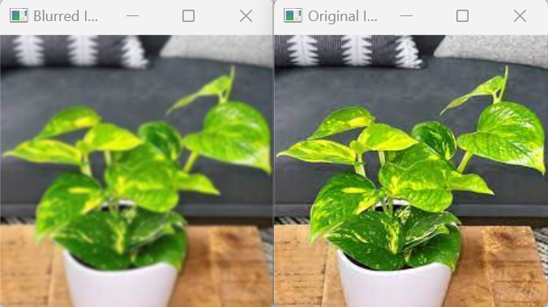
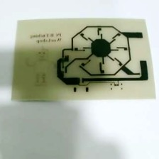
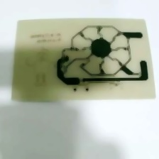
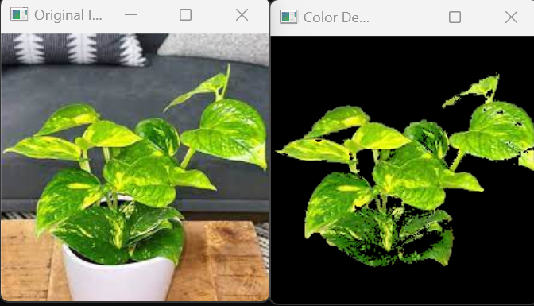
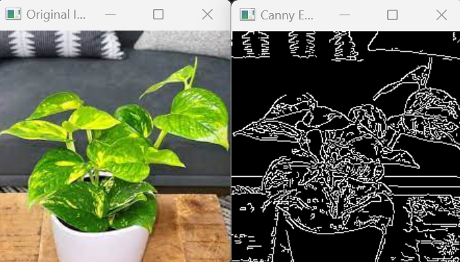
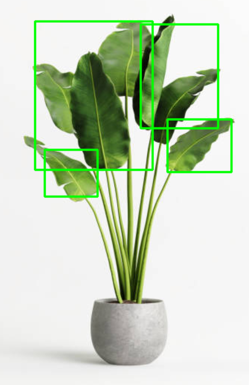
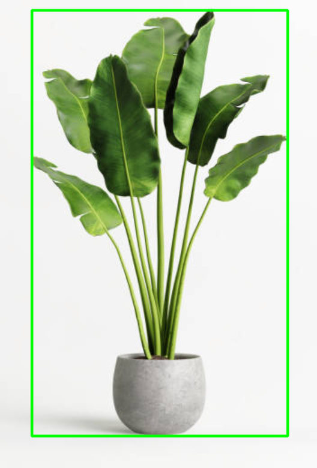

# Image Processing

# Image Processing in Python on Ultra96

After knowing the basics of IC, MPSoC and Ultra96, let's try to implement image processing algorithms in Ultra96 using Jupyter Notebook and Python.

Power on Ultra96 and open a new notebook in Exercise/Image_Processing.ipynb 

# Filter in Image Processing

Filtering is a fundamental operation in image processing that involves modifying the pixels of an image to achieve des
ired effects such as noise reduction, edge detection, or image enhancement.
## [Material for this session](https://stemturnede.sharepoint.com/:u:/g/EULXb62uu1dBjEOB8kQsvCwBFOABUB0m6HI7jauE5FemWw?e=IQE6Fm)

## Principle of Filtering

Filtering is typically performed using a convolution operation. A filter, also known as a kernel or mask, is a small matrix that is applied to each pixel of the image. The filter modifies the pixel values based on the values of its neighboring pixels.


The convolution process involves sliding the filter over the image and computing the weighted sum of the filter values multiplied by the corresponding pixel values in the neighborhood. This calculation is performed for each pixel, resulting in a new filtered image.

## 1. Gaussian Filter

The Gaussian filter is a popular smoothing filter used for noise reduction. 

It blurs the image by averaging the pixel values in the neighborhood, with more emphasis on the central pixel. 

This filter is effective in reducing high-frequency noise while preserving the overall image structure.

### Example: Applying a Gaussian Filter

Here's an example of applying a Gaussian filter to an image using Python and OpenCV:

```python
import cv2
    
# Load the image
image = cv2.imread('path/to/image.jpg')

# Apply Gaussian blur
blurred_image = cv2.GaussianBlur(image, (5, 5), 0)

# Display the original and blurred images
cv2.imshow('Original Image', image)
cv2.imshow('Blurred Image', blurred_image)
cv2.waitKey(0)
cv2.destroyAllWindows()
```


The above code utilizes a Gaussian filter to add blur to an image

## 2. Median Filter

The median filter is another type of noise reduction filter. 

It replaces each pixel value with the median value of its neighboring pixels. 

This filter is particularly useful for removing salt-and-pepper noise, where isolated pixels have extreme intensity values.

Example:
```python
import cv2
import numpy as np
image = cv2.imread("3.jpg")

median = cv2.medianBlur(image,5)
cv2.imshow('Median Filter', median)
cv2.waitKey(0)
cv2.destroyAllWindows()
```




## 3. Bilateral Filter
A bilateral filter is an image filtering technique that aims to reduce noise while preserving the edges and details of an image. 

It achieves this by applying a weighted average to the pixels in the image, where the weights depend on both the spatial proximity and intensity similarity between pixels.

Example:

```python
import cv2

image = cv2.imread('3.jpg')
bilateral = cv2.bilateralFilter(image, 9, 75, 75)
cv2.imshow('Bilateral Filter', bilateral)

cv2.waitKey(0)
cv2.destroyAllWindows()
```

The three above filters are mainly used at reducing noise however, there are also other filters which serve other purposes such as the sobel filter.

## 4. The Sobel Filter

The Sobel filter is an edge detection filter that calculates the gradient of an image. 

It applies a convolution operation to the image using two separate kernels to estimate the horizontal and vertical derivatives. 

The Sobel filter highlights edges by emphasizing regions with rapid changes in intensity.

Example code:

```python
import cv2

image = cv2.imread('input_image.jpg', cv2.IMREAD_GRAYSCALE)

# Apply the Sobel filter
sobel_x = cv2.Sobel(image, cv2.CV_64F, 1, 0, ksize=3)  # Sobel filter along the x-axis
sobel_y = cv2.Sobel(image, cv2.CV_64F, 0, 1, ksize=3)  # Sobel filter along the y-axis

# Convert the filtered images back to uint8
sobel_x = cv2.convertScaleAbs(sobel_x)
sobel_y = cv2.convertScaleAbs(sobel_y)

# Combine the x and y gradients
sobel_result = cv2.addWeighted(sobel_x, 0.5, sobel_y, 0.5, 0)

# Display the original image and the Sobel result
cv2.imshow('Original Image', image)
cv2.imshow('Sobel Result', sobel_result)
cv2.waitKey(0)
cv2.destroyAllWindows()
```

## 5. The Laplacian Filter

The Laplacian filter is another edge detection filter that highlights regions of rapid intensity changes in an image. 

It calculates the second derivative of the image by convolving it with a Laplacian kernel. 

The Laplacian filter enhances edges and is often combined with other filters for edge detection.

```python
import cv2
import numpy as np

# Load the image
image = cv2.imread('plant2.jpg', cv2.IMREAD_GRAYSCALE)

# Apply the Laplacian filter
laplacian = cv2.Laplacian(image, cv2.CV_64F)

# Convert the filtered image back to uint8
laplacian = cv2.convertScaleAbs(laplacian)

# Display the original image and the Laplacian result
cv2.imshow('Original Image', image)
cv2.imshow('Laplacian Result', laplacian)
cv2.waitKey(0)
cv2.destroyAllWindows()
```

# Color Filtering for Segmentation

Color filtering is a technique used in computer vision and object detection to isolate specific objects based on their color properties. By filtering out colors that do not match the desired range, we can highlight regions of interest in an image.

## How Color Filtering Works

Color filtering involves converting an image from one color space to another, such as RGB to HSV or RGB to HLS. Different color spaces represent color information differently, making it easier to isolate specific colors.

Once we have converted the image to the desired color space, we can define a range of colors to filter. This range is specified using minimum and maximum threshold values for each color channel. Pixels within this range are considered to match the desired color, while others are filtered out.

## Example: Segmenting Green Objects

Here's an example of using color filtering to segment green objects in an image using Python and OpenCV:

```python
import cv2
import numpy as np

# Load the image
image = cv2.imread('path/to/image.jpg')

# Convert the image to the HSV color space
hsv_image = cv2.cvtColor(image, cv2.COLOR_BGR2HSV)

# Define the lower and upper thresholds for red color
lower_red = np.array([0, 50, 50])
upper_red = np.array([10, 255, 255])

# Create a mask by applying the color thresholds
mask = cv2.inRange(hsv_image, lower_red, upper_red)

# Apply the mask to the original image
result = cv2.bitwise_and(image, image, mask=mask)

# Display the original image and the result
cv2.imshow('Original Image', image)
cv2.imshow('Result', result)
cv2.waitKey(0)
cv2.destroyAllWindows()
```


In the code above, we first convert the image from the BGR color space to the HSV color space using cv2.cvtColor(). 

Then, we define the lower and upper thresholds for the red color in the HSV color space.

We create a binary mask by applying these thresholds using cv2.inRange(). 

Finally, we apply the mask to the original image using cv2.bitwise_and() to obtain the result.

The resulting image will only show the green objects in the scene, while the rest of the image will be black.

Color filtering can be performed for segmenting objects of different colors by adjusting the threshold values accordingly.

# Canny Edge Detector for Segmenting

The Canny edge detector is a popular algorithm used in computer vision for detecting edges in images. It is widely used in object detection and image segmentation tasks. The Canny edge detector provides robust edge detection by suppressing noise and accurately locating edges with sub-pixel precision.

## How the Canny Edge Detector Works

The Canny edge detection algorithm consists of the following steps:

1. **Noise Reduction**: The input image is smoothed using a Gaussian filter to reduce noise and eliminate small variations in pixel values.

2. **Gradient Calculation**: The gradient magnitude and direction are computed for each pixel in the smoothed image. This step highlights areas of rapid intensity change, which typically correspond to edges.

3. **Non-maximum Suppression**: The algorithm performs non-maximum suppression to thin out the detected edges. Only the local maxima in the gradient direction are preserved, while suppressing the rest of the pixels.

4. **Double Thresholding**: Two threshold values, a high threshold and a low threshold, are used to classify the pixels as strong, weak, or non-edges. Strong edges are pixels with gradient magnitudes above the high threshold, while weak edges have magnitudes between the high and low thresholds.

5. **Edge Tracking by Hysteresis**: The weak edges are further analyzed to determine if they are part of strong edges. If a weak edge is connected to a strong edge, it is considered part of the edge. This step helps to connect fragmented edges and suppress noise.

## Example: Applying the Canny Edge Detector

Here's an example of applying the Canny edge detector to an image using Python and OpenCV:

```python
import cv2

# Load the image in grayscale
image = cv2.imread('path/to/image.jpg', 0)

# Apply Canny edge detection
edges = cv2.Canny(image, threshold1, threshold2)

# Display the original image and the edges
cv2.imshow('Original Image', image)
cv2.imshow('Edges', edges)
cv2.waitKey(0)
cv2.destroyAllWindows()
```


In the code above, we load the image in grayscale mode using the flag 0. We then apply the Canny edge detector using cv2.Canny(), specifying the threshold values threshold1 and threshold2. The resulting edges are displayed using cv2.imshow().

Adjusting the threshold values will affect the sensitivity of edge detection. You may need to experiment with different threshold values to achieve the desired results.

## Object Detection

Now that we have ways to segment the objects of images out, we will look into object detection methods which allow us to detect the objects we want.

There are three main methods going to be introduced here

1) Colour based detection

2) Edge based detection

3) Haarcascade

## Colour based Detection

As seen previously, it is possible to segment out a certain colour of an image, but how about doing detection of objects of a certain colours.

There are a few things to remember before trying to program such a detector,

1. Colour detectors heavily depend on the background environment

- if the object you are trying to detect is green and your background is green, it will be difficult to detect

2. the size of your object

- if your object is too small in size, it is possible it may be missed out

3. noise and blur

- if your image is blurry due to motion or noisy due to the hardware, it is possible to get false detection

To detect an object, we can use the find contours function.

It requires a mask which is our colour range as well as a morphological opening to remove any small objects in the image after colour thresholding

It can check for the boundaries in an image if it passes a crtain threshold, we return it as an object.

Here's is an example code

```python
import cv2
import numpy as np

# Load the image
image = cv2.imread('plant2.jpg')

# Convert the image to the HSV color space
hsv = cv2.cvtColor(image, cv2.COLOR_BGR2HSV)

# Define the lower and upper thresholds for the green color range
lower_green = np.array([40, 50, 50])  # Adjust these values based on your desired green color range
upper_green = np.array([80, 255, 255])

# Create a mask based on the green color range
mask = cv2.inRange(hsv, lower_green, upper_green)

# Perform morphological operations to enhance the mask and remove noise
kernel = cv2.getStructuringElement(cv2.MORPH_RECT, (5, 5))
mask = cv2.morphologyEx(mask, cv2.MORPH_OPEN, kernel)

# Find contours of the objects in the mask
contours, _ = cv2.findContours(mask, cv2.RETR_EXTERNAL, cv2.CHAIN_APPROX_SIMPLE)

# Set a minimum area threshold to filter out small objects
min_area = 200  # Adjust this value based on your requirements

# Draw bounding boxes around the detected objects
for contour in contours:
    area = cv2.contourArea(contour)
    if area > min_area:
        x, y, w, h = cv2.boundingRect(contour)
        cv2.rectangle(image, (x, y), (x + w, y + h), (0, 255, 0), 2)

# Display the original image with bounding boxes
cv2.imshow('Green Color Detection', image)
cv2.waitKey(0)
cv2.destroyAllWindows()
```

Things to note, once we have the contours which is the boundary of the objects, it is important to set a minimun size based on the object we are trying to detect as otherwise it is possible to receive a lot of object boxes which may not be that useful to us for further processing.



## Edge based detection

As seen earlier, it is possible to segment out objects using a canny edge detector to filter out the objects

Using a similar process to the colour object detector, we can create an object detector using canny edge detector.

Here's a sample code:

```python
import cv2
import numpy as np

# Load the image
image = cv2.imread('plant3.jpg')

# Convert the image to grayscale
gray = cv2.cvtColor(image, cv2.COLOR_BGR2GRAY)

# Apply Gaussian smoothing
blurred = cv2.GaussianBlur(gray, (5, 5), 0)

# Apply Canny edge detection
edges = cv2.Canny(blurred, 30, 70)

# Perform morphological operations to enhance edges and remove small noise
kernel = cv2.getStructuringElement(cv2.MORPH_RECT, (3, 3))
edges = cv2.morphologyEx(edges, cv2.MORPH_CLOSE, kernel)

# Find contours of the refined edges
contours, _ = cv2.findContours(edges, cv2.RETR_EXTERNAL, cv2.CHAIN_APPROX_SIMPLE)

# Set a minimum area threshold to filter out small objects
min_area = 200  # Adjust this value based on your requirements

# Draw bounding boxes around the detected objects
for contour in contours:
    area = cv2.contourArea(contour)
    if area > min_area:
        x, y, w, h = cv2.boundingRect(contour)
        cv2.rectangle(image, (x, y), (x + w, y + h), (0, 255, 0), 2)

# Display the original image with bounding boxes
cv2.imshow('Object Detection', image)
cv2.waitKey(0)
cv2.destroyAllWindows()
```

In the above code, we use a similar method to the colour detection by using contours to find the boundaries of our image



Comparing it to the colour detector there are a few noticable things,

The canny detector can detect the full pot and plant but the colour detector can only detect the plant leaves.

This should remind you that based on the situation and background of the object, each detector will perform differently so choose based on your target.

## Haarcascade Detector

The haarcascade detector is used to detect faces, although it is also possible to train it to detect other objects as well

To implement it we will be using the provided trained file by opencv and their detect function

Here's an example

```python
import cv2

# Load the pre-trained Haar cascade XML file for face detection
cascade_path = cv2.data.haarcascades + 'haarcascade_frontalface_default.xml'
cascade = cv2.CascadeClassifier(cascade_path)

# Load the image
image = cv2.imread('plant2.jpg')

# Convert the image to grayscale
gray = cv2.cvtColor(image, cv2.COLOR_BGR2GRAY)

# Perform face detection using the Haar cascade
faces = cascade.detectMultiScale(gray, scaleFactor=1.1, minNeighbors=5, minSize=(30, 30))

# Draw bounding boxes around the detected faces
for (x, y, w, h) in faces:
    cv2.rectangle(image, (x, y), (x + w, y + h), (0, 255, 0), 2)

# Display the image with bounding boxes
cv2.imshow('Face Detection', image)
cv2.waitKey(0)
cv2.destroyAllWindows()
```

As seen above, we load the model and call the detect functions.

Then we draw the boxes with the coordinates of the results.

## Using opencv to use the camera for real time detection.

First we need to open the video capture using VideoCapture(0)

After that we need to keep looping such that we can process every frame

We can obtain the info of each frame using cap.read()

Run our detection algorithm on it

Display the results

Add a section to handle exiting the loop.

Make sure to add any variables or useful tools outside the loop unless it is required to be inside the loop as it may waste computing resources.

Here is some example code

```python
import cv2
import numpy as np

# Set the lower and upper bounds for black color in HSV color space
lower_black = np.array([0, 0, 0], dtype=np.uint8)
upper_black = np.array([179, 255, 30], dtype=np.uint8)

# Set the minimum contour area threshold
min_contour_area = 200

# Set the kernel size for morphological operations
kernel_size = 5

# Open the video capture device (webcam)
cap = cv2.VideoCapture(0)

while True:
    # Read a frame from the video capture
    ret, frame = cap.read()

    # Convert the frame to HSV color space
    hsv = cv2.cvtColor(frame, cv2.COLOR_BGR2HSV)

    # Create a mask for black color detection
    mask = cv2.inRange(hsv, lower_black, upper_black)

    # Perform morphological closing to fill small gaps in black regions
    kernel = cv2.getStructuringElement(cv2.MORPH_ELLIPSE, (kernel_size, kernel_size))
    mask = cv2.morphologyEx(mask, cv2.MORPH_CLOSE, kernel)

    # Find contours in the mask
    contours, _ = cv2.findContours(mask, cv2.RETR_EXTERNAL, cv2.CHAIN_APPROX_SIMPLE)

    # Filter contours based on area threshold
    filtered_contours = [cnt for cnt in contours if cv2.contourArea(cnt) > min_contour_area]

    # Draw bounding boxes around the filtered contours
    for cnt in filtered_contours:
        x, y, w, h = cv2.boundingRect(cnt)
        cv2.rectangle(frame, (x, y), (x + w, y + h), (0, 255, 0), 2)

    # Display the resulting frame
    cv2.imshow('Black Color Detection', frame)

    # Exit the loop if 'q' is pressed
    if cv2.waitKey(1) & 0xFF == ord('q'):
        break

# Release the video capture device and close the windows
cap.release()
cv2.destroyAllWindows()
```
# Class Task
Using function and what you have learn in lesson 1, alternate the abovemention detection code by creating dedicated functions for the following colours detection:
- black(default)
- white
- red
- yellow
- blue
