# Guide to set-up the Vmware Player

## 1. Installing the VMware

In https://internal.semproject.us/s/pkKGT5LaiQEnCfD youi should be able to find and download the Vitis-Ai.zip, Xilinx tar.gz file, unduntu iso file and Vmware player.exe file. Please download all 4 of them to your local PC.

Once downloaded, run the VMware exe file and follow the steps to install VMware on your local PC.

## 2. Creating a Virtual Machine with Ubuntu 20.04.03 Image.

Now that VMware is installed, run VMware. You should reach the home page. Click create a New Virtual Machine.

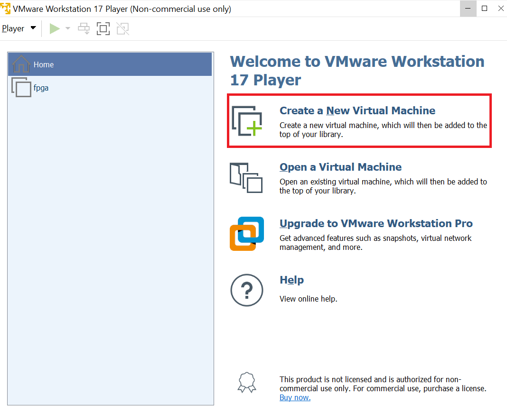

Then select the correct disc image file to be the ubuntu 20.04.03 iso file we downloaded earlier. 

Click browse and search for the file in the correct directory.

Click next once you are done with this.

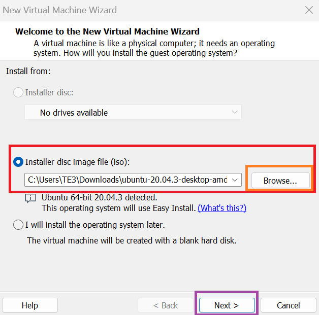

Now it is time to set up the username and password of the VM. Please set the full name and User name to

```python
fpga
```

and the password to

```python
changeme
```

This will ensure you do not forget any details of the VM during the training process. You can update the name later to something else if needed. 

Click next once you are done.

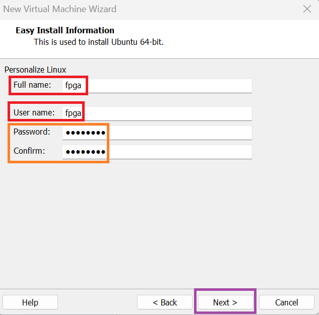

Now please assign the name of the virtual machine to be displayed as

```python
fpga
```

and set the location of the VM to where you want it to be or have space. This can be modified as seen in the orange box.

Click next when done.

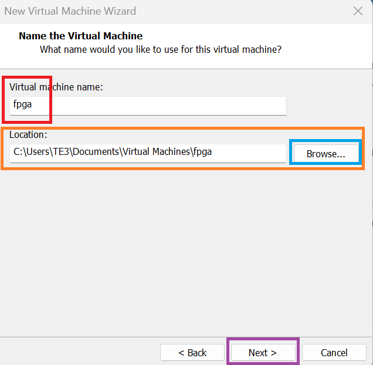

Next please assign at least 400 GB disk size for the virtual machine as Vivado will use up at least 300 GB during the installation Process. Thus we want to avoid running out of space.

Then select split virtual disk into multiple files.

Click next when you are done.

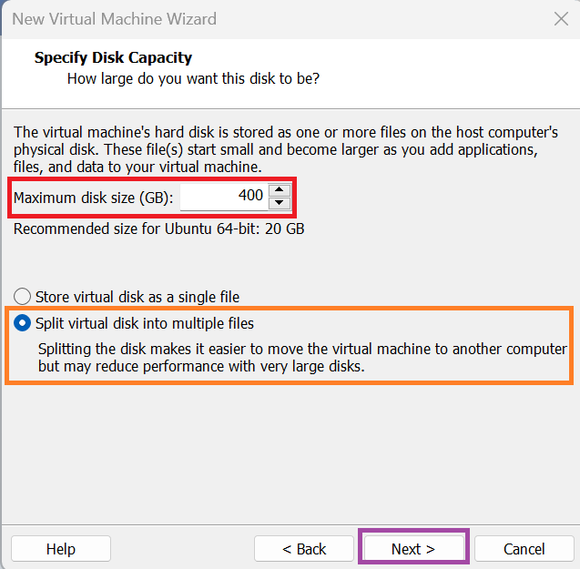

Now do not click `finish` click customize hardware as we will also have to assign the ram and cpu cores for the virtual machine.

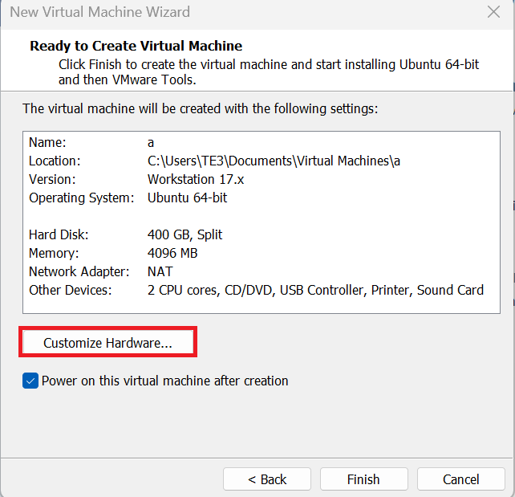

Go to the Memory tab and select the maximum recommended memory by clicking the blue triangle. 

This will be different from the photo on your local machine due to different amount of ram installed on your PC.

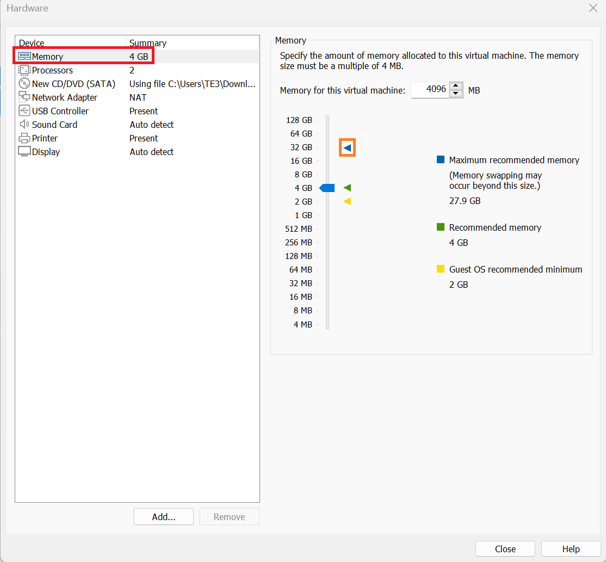

Now click on the Processors tab. Select the maximum amount of Processor cores your machine allows. Could be in the range of 8-16 depending on your PC.

Click close once you are finished.

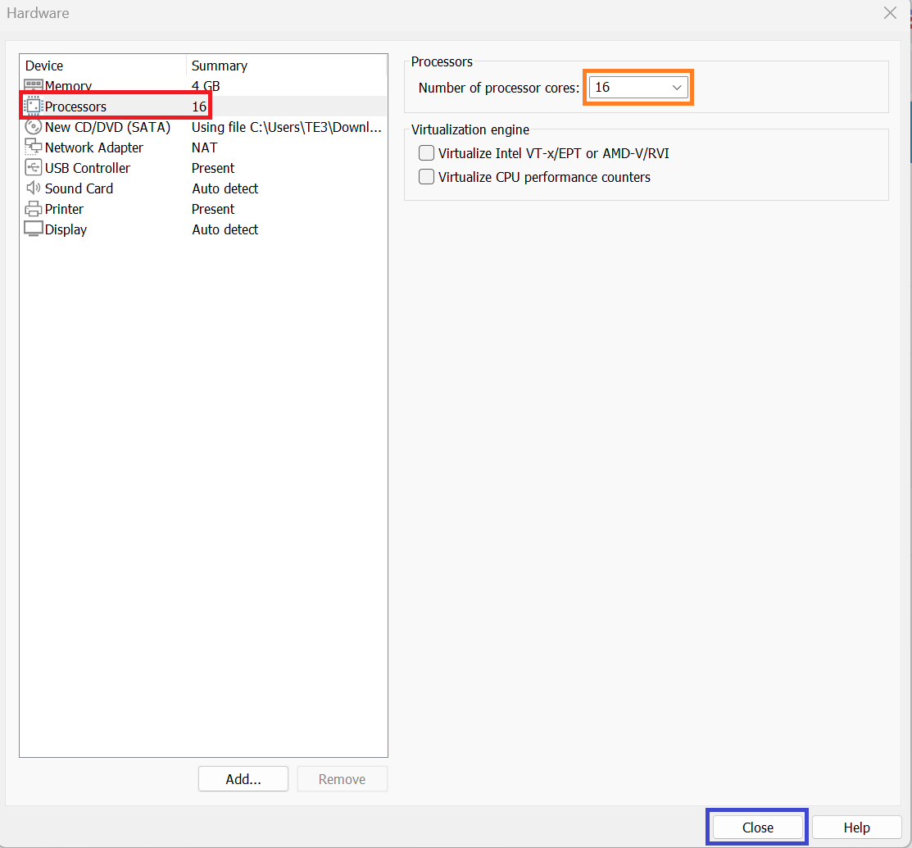

Finally make sure power on this vm is selected before clicking finish to finish setting up the VM and turning it on. 

An internet connection will be required to finish setting up the OS and installing some required updates later.

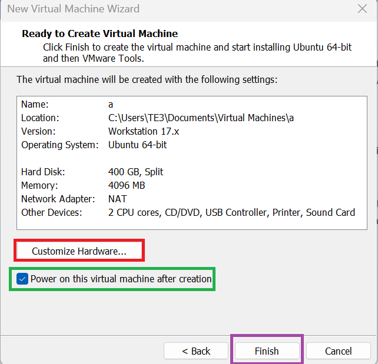

## 3. Post Set-up Linux updates.

Now that we have set up the VM, before adding any files make sure to follow the following steps to add updates to the linux environment such that we do not have any issues when setting up Vivado and Vitis-AI later.

Please open terminal by clicking on the square icon on the bottom left.

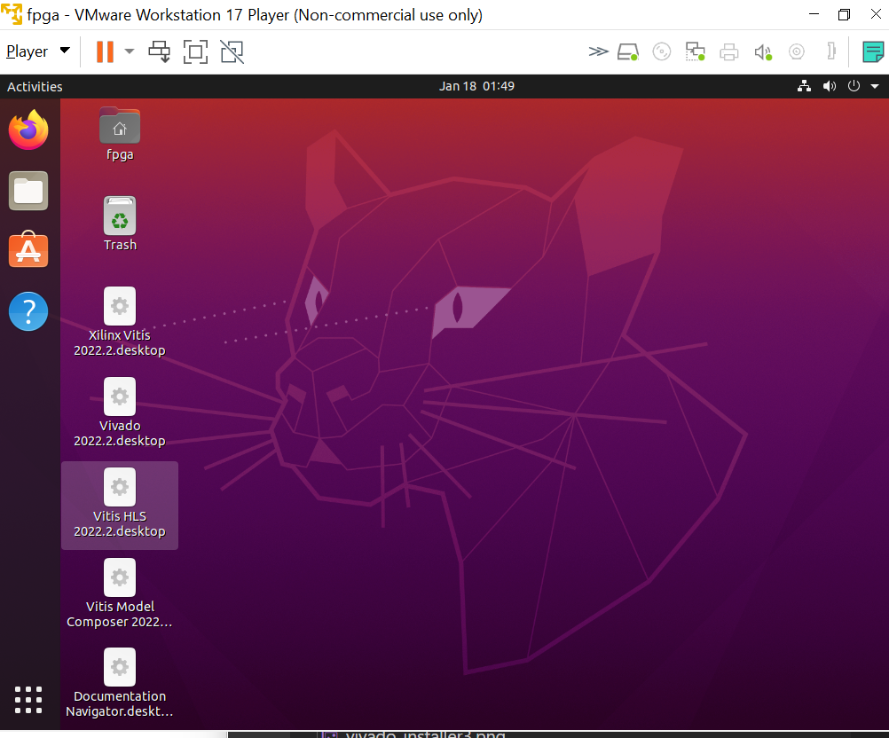

Then click the terminal icon.

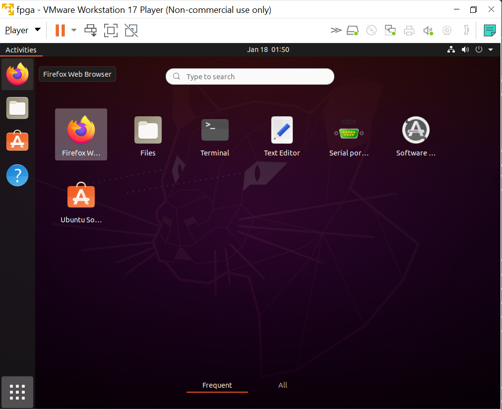

You can also click ctrl alt T on your keyboard.

After that type the following scripts on your terminal.

```bash
sudo apt-get update
```

```bash
sudo apt-get install vim
```

```bash
sudo apt-get install libtinfo5
```

This is the bare minimun required to make everything work.

## 4. Transferring the files to the VM.

Not that we have set up linux, it is time to transfer the file to linux.

To do so, drag the file you would like to be moved to the virtual machine make sure you are in the home directory by clicking the folder icon. Here is an example

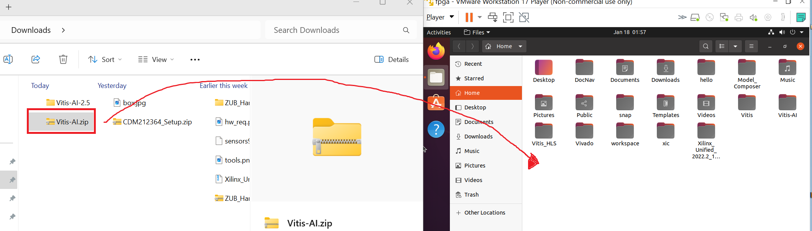

Repeat this process for all of the files required (Vitis-AI, Vivado)

## 5. Setting up Vivado.

To set up vivado, first we have to unzip the file. To do so, use the following command in the terminal. Make sure you are in the correct directory.

```bash
tar -xzvf Xilinx_Unified_2022.2_1014_8888.tar.gz
```

Wait for it to extract all the files before going to the extract folder and running the xsetup script. Use the following bash code from the home directory.

```bash
cd Xilinx_Unified_2022.2_1014_8888
```

```bash
./xsetup
```

Once that installer starts, click next on the first page.

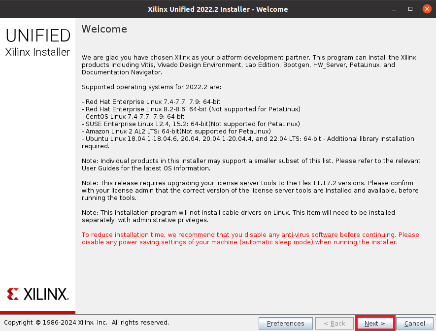

Select Vitis. Then click next.

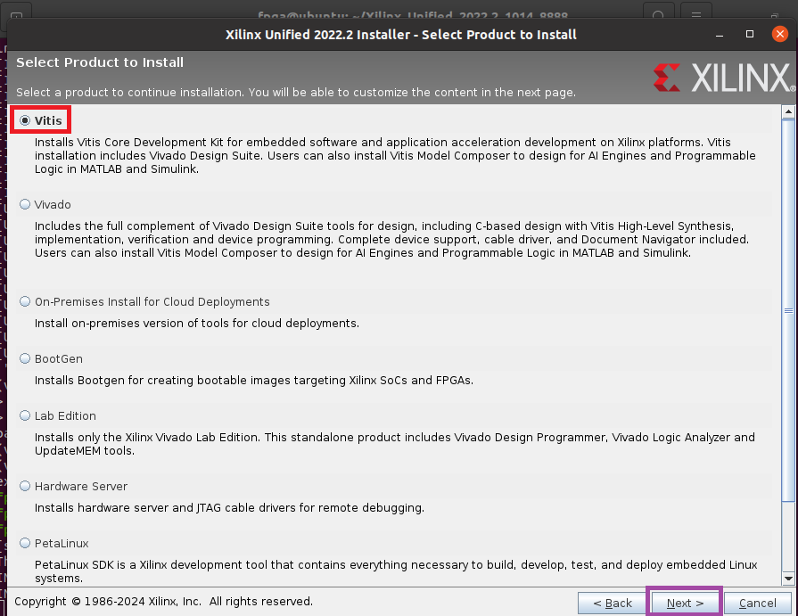

Follow the diagram below to check what should be installed. Just make sure to not install whats in the red box (Vitis model Composer and Doc Nav as they are not required). Otherwise follow the picture then click next.

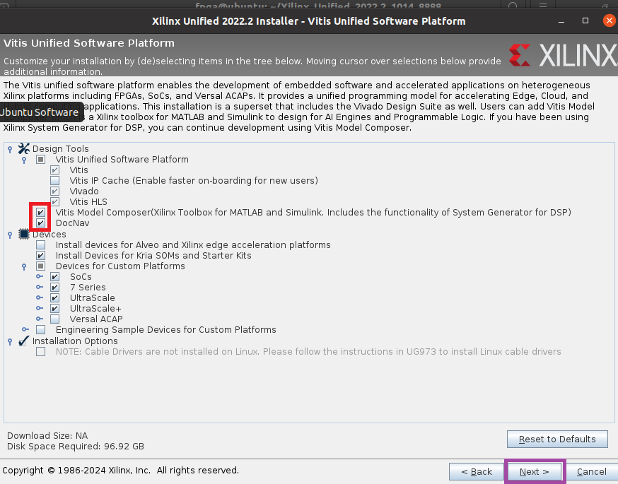

Agree to the terms of service.

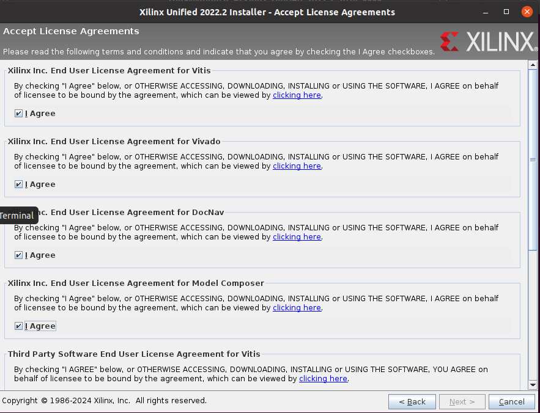

Then install it in home/fpga as seen in the figure below. Click the 3 dots to change your directory to the correct one. 

Click next once that has been done.

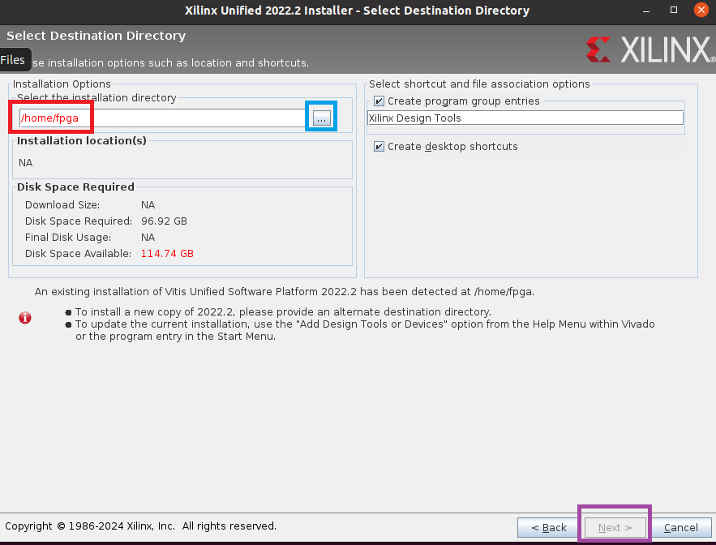

Follow the instructions for the remaining steps and wait for it to install should take 10 mins at least.

## 6. Setting up Vitis-AI

To set up Vitis-AI, first go back to the home directory by typing

```bash
cd ..
```

Then follow the steps in Vitis-AI in Versel. Stop before quantizing the model.