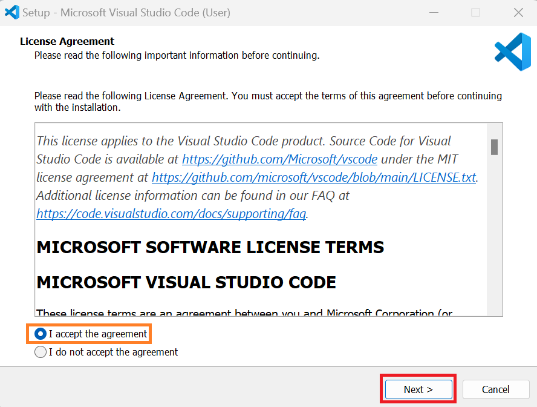
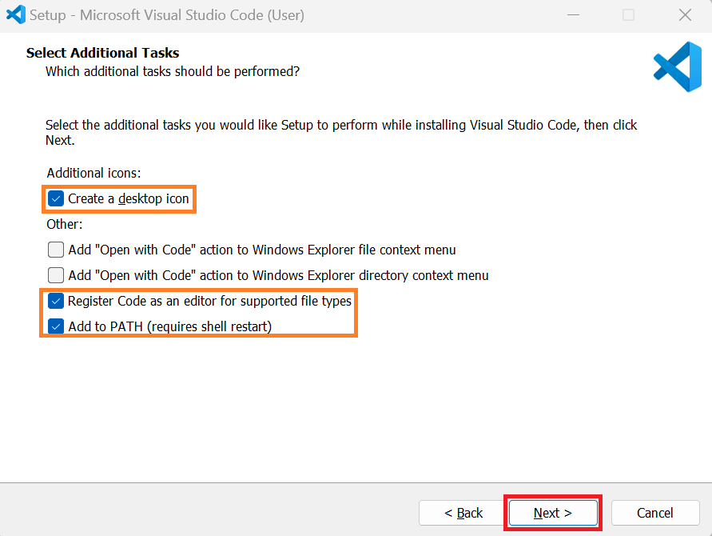
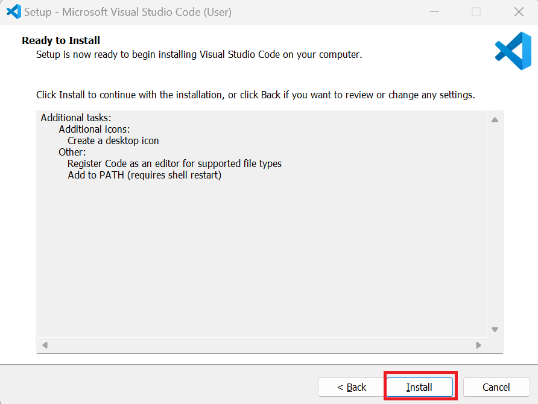
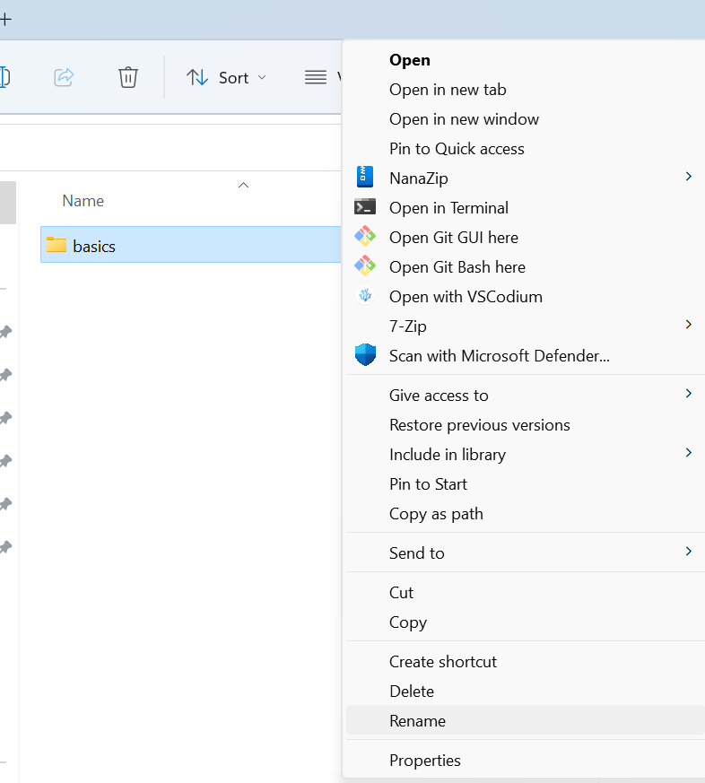
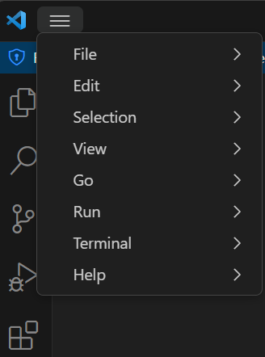
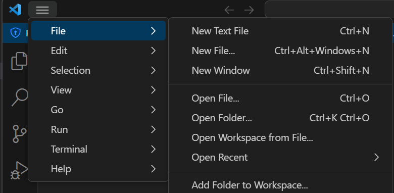
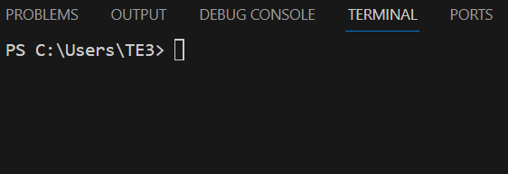

# Python Basics

## Introduction

This document provides a step-by-step guide on using Python to write code, assign variables, perform operations, use control statements, loops, and functions. It also covers the basics of working with strings, integers, floats, and lists. 

## Installing Python

To get started with Python, follow these steps:

1. Run the python installer


2. Before clicking install make sure to click add to path


3. Install

If all goes well you should not receive any errors and python should be installed successfully

## Installing VScode

Now that we have python installed lets go ahead and install VScode an idle which can allow you to better manage your code.

To get stated with VScode, follow these steps:

1. Run the VScode installer

2. Agree to the terms of coditions



3. Make sure add to path has been checked



4. Install



If all goes well you should not receive any errors and VScode should be installed successfully

## Setting up the directory to store our python files
Before we start coding lets create a new folder called python
inside the folder create another folder called basics

1. Right click
2. Select New -> Folder
3. Name it `python`


4. Inside the new folder 
Right Click

5. Select New -> Folder


6. Name it `basics`

It should appear inside the python folder we just created


If you need to rename your folder

Left click the folder once so that it is highlighted

Then right click

Select Show More options

At the bottom you will see rename



## Getting started with coding in python

In order to start coding your first program in python, follow the following steps:

1. Open VScode.
2. Go to `File` and select `open folder`.





3. select the `basics` folder we just created
4. Then go to `File` and select `new file`
5. type the file name `hello.py`


6. save it in the `basics` folder
7. Type the following code
```python
name = "hello"
print(name)
```
8. Save the file with `Ctrl  S` or `file save`
9. Run the code using the following method:
   - use the terminal built in VScode
   - on the top left the 3 bars 


   - Select `New Terminal`
   - The terminal will show up at the bottom of your screen



   - Type the following into the terminal: `python hello.py`
   - as long as you opened the correct folder, the program should be run successfully


## Installing Libraries

Included with python is pip which allows you to install python libraries using the command line.
To do so 
- first google the installation command of the library you want to install e.g. pip install opencv-python

- Then goto the command line
- type the command in
- e.g. `pip install opencv-python`

If all goes well you should not reveive any errors and the library should be installed successfully

You may ignore warnings as long as it does not affect the functionality of the library.

## Variables and Output

Variables can be created and assigned values in Python using the assignment operator `=`. To assign a word or string, enclose it in either double quotes (`" "`) or single quotes (`' '`). The `print()` function is used to display the output. From earlier:

```python
name = "hello"
print(name)
```
## Variables in Python

In Python, variables are used to store and manipulate data. They act as placeholders for values that can change during the execution of a program. Here are some key points to understand about variables in Python:

### Declaration and Assignment

Variables in Python are declared by assigning a value to them using the assignment operator (`=`). For example:

```python
age = 25 # int
name = "John" # string
old = False # boolean
time = 22.4 # float
```
Strings and Other Variable Types

Strings are sequences of characters in Python. They can be assigned by enclosing the text in quotes. Other variable types include integers, floats, booleans, and lists. In Python, integers and floats can be automatically assigned. Comments in Python are indicated using the # symbol.

Example with a list:

```python
food = ["Pizza", "Noodles", "Pasta"] #list
print(food[0])
```
In this case to access an element from the list, we type the variable name followed by [index] where index allows us to control which element we want to retrieve

In python indexes start from 0
So to access `Pizza` we use `food[0]` 
Similarly for `Noodles` we would use the index of `[1]`

Also the default value of a variable is `None`

If you want to check if a variable is None you can use a if statement

```python
result = None
if result is None:
    print("No result availiable")
```

### Input and Output
As seen earlier if you want to print something out to the user you use the `print()` function but what if you want to receive an input?
To do so you can use the `input()` function but make sure to assign the correct data type based on what you expect to be inputted

```python
number = input("Enter a number")
print(number)
```

this allows you to take inputs from the user if required

# If Statements

If statements are one of the main ways to add logic into your python program.
It acts something similiar to choosing between a chocolate or candy bar
for example you have 5 dollars
chocolate costs 6
candy costs 4
so you can only buy the candy bar

```python
if (money>= price of chocolate):
    # buy chocolate
elif #I want candy:
    # buy candy
else:
    # buy nothing
```
How it works is if you have enough money to buy chocolate you will buy chocolate

Otherwise if you like candy but cant afford chocolate you'll buy candy 

Otherwise you won't buy anything

Here's a completed version of the above example
```python
food = ["chocolate", "candy"]
money = 2
price_of_chocolate = 6
price_of_candy = 4
likecandy = True
if(money>=price_of_chocolate):
    numberchocolate = int(money/price_of_chocolate)
    money_left = money - price_of_chocolate*numberchocolate
    print("I bought " + str(numberchocolate) + " " + food[0])
    print("I have " + str(money_left) + " dollar left")
elif(likecandy and money>= price_of_candy):
    numbercandy = int(money/price_of_candy)
    money_left = money - price_of_candy*numbercandy
    print("I bought " + str(numbercandy) + " Candy")
else:
    print("I bought nothing")
```

As you can see it combines everything we have learned so far as well as a few new things

For `print()` it only accepts `strings` so if we want to print an integer out we need to first convert it to a string using `str()`

also when doing division if we get a value of 1.1 out but only want 1 we can use `int()` to convert the float to an int

To add a space in print() we can use `" "` as it can help add a space 

To print multiple words we can use the `+` to link 2 strings together

# Operators

The following operators are what allows you to set the conditions in if statements as well as variables

- `+`, `-`, `*`, `/`, `//`, `%` are used for calculations.
- `>`, `>=`, `<`, `<=`, `==`, `!=` are used for comparisons.
- `and`, `or`, `not` are used to compare boolean values.

For calculations:
- `+` is used for addition.
- `-` is used for subtraction.
- `*` is used for multiplication.
- `/` is used for division.
- `//` is used for floor division (division that rounds down to the nearest whole number).
- `%` is used for modulus (returns the remainder of division).

For comparisons:
- `>` is used for "greater than".
- `>=` is used for "greater than or equal to".
- `<` is used for "less than".
- `<=` is used for "less than or equal to".
- `==` is used for equality (checking if two values are equal).
- `!=` is used for inequality (checking if two values are not equal).

For boolean comparisons:
- `and` is used for a logical "and" operation (both conditions must be true).
- `or` is used for a logical "or" operation (at least one condition must be true).
- `not` is used for a logical negation (reverses the boolean value).

# While Loop
A while loop allows you to keep repeating a section of the code until your condition set has become false.
This also means if you do not set your condition to false, your code will run forever so please be careful when designing your program.

To achieve this, we can use a loop and a control variable. Here's an example:

```python 
i = True
while i:
    # Code to be repeated
    if condition:
    i= False
```
In the example above, we start by setting the control variable `i` to `True`. We then enter a `while` loop, which will continue executing the code block as long as `i` remains `True`. Within the loop, we have an `if` statement that checks a condition. If the condition is met, we set `i` to `False`, which will eventually cause the loop to exit.

By using this structure, the code will repeat until the desired state is achieved, at which point the control variable is modified to end the loop.    

Other ways to exit a loop:

- `break`: The `break` statement is used to immediately exit a loop. When encountered within a loop, `break` will terminate the loop and the program execution will continue with the next statement after the loop.

-`continue`: The `continue` statement allows you to skip any code after the continue statement and go back to the begining of the loop and start the code from there. Usually you use an if statement to find a condition which you do not want then change some variable in the loop then use a continue statement to skip the rest of the loop and start a new iteration in your loop

For example:

```python
i = 0
while(i<10):
    if (i ==5):
        i+=1
        continue
    elif(i==8):
        print(10)
        break
    else:
        print(i)
    print(" end of loop")
    i += 1
```
So as seen in the example above, the control is i<10 but you can also use any of the other operators to change the logic if needed
the if statement checks if 1 is equal to 5 if so it increases i by 1
otherwise if i is equal to 8 it prints 10 then breaks out of the loop
otherwise it prints i and increases i by 1
once the if else statements are done it prints end of loop before starting a new iteration of the loop and increases i by 1

# For Loop

Similar to a while loop, the `for` loop is used to iterate through a condition. It is commonly used when you know the number of iterations in advance or when you want to iterate over a sequence of elements.

The syntax of a `for` loop in Python is as follows:

```python
for i in range(10):
    # Code to be executed within the loop

```

The loop runs the code then increases the counter of i from 0 to 1 all the way to 9 
A coomon usage of for loops is to access lists in python

```python
food = ["Pizza", "Pasta", "Noodles", "Chocolate", "Candy"]
for i in range(len(food)):
    print(food[i])
```

In this example the `len` function gets the length of the list and the for loop prints every element inside the list without going out of range

# Functions

To define a function in Python, you can use the `def` keyword. The syntax for defining a function is as follows:

```python
def function_name(parameters):
    # Code to be executed within the function
    return value
 ```

 Example
 ```python
 def factorial(n):
    # Code to calculate the factorial of n
    result = 1
    for i in range(1, n+1):
        result *= i
    return result   
 ```
It is important to declare functions first before using them otherwise you will receive an error

 # Syntax

 Syntax and Indentation in Python

In Python, proper indentation is crucial for code structure and readability. Indentation is used to define the structure of blocks of code, such as loops, if statements, and function definitions. It is enforced by the Python interpreter and helps identify the scope and hierarchy of code blocks.

Indentation is typically done using the Tab key or a consistent number of space characters (e.g., four spaces) at the beginning of each indented line.

One thing to note is the amount of spaces used for indentation does not matter but for good practice do use at least 2-4

Also ensure all your code for that statement whether it is if loop or function is indented at the same amount of space otherwise you will receive a syntax error

If you use a nested statement you will need to indent the code even more
Here are some guidelines on when to use indentation:

1. Loops:
   ```python
   for i in range(5):
       # Code within the loop
    ```

2. If-statements
```python 
if condition:
    # Code to execute if condition is true
else:
    # Code to execute if condition is false
```
3. Functions
```python
def my_function():
    # Code within the function
```

4. Nested
```python
def my_function():
    while True:
        if #something:
            return
        else:
            return #something

The code within the function definition is indented to indicate that it belongs to the function's body.
The code within the if statement and else statement is indented to indicate that it is conditionally executed based on the condition.  

# Comments in Python

Comments are lines of text in a program that are not executed as part of the code. They are used to provide additional information or explanations about the code and help make it more readable and understandable for humans.

In Python, comments can be created using the `#` symbol. Anything that follows the `#` symbol on the same line is considered a comment and is ignored by the Python interpreter.

Here are some key points about comments in Python:

- Comments are used to add explanatory notes to the code, describe the purpose of certain sections, or provide context to other developers.

- Comments are not executed or processed by the Python interpreter. They are solely meant for human readers and do not affect the program's functionality.

- Comments can be placed at the end of a line of code or on separate lines.

- Comments can be used to temporarily disable or "comment out" lines of code that you don't want to execute.

- Comments are also useful for documenting code and making it easier to understand and maintain.

Here's an example of comments in Python:

```python
# This is a single-line comment

x = 5  # Assigning the value 5 to the variable x

"""
This is a
multi-line
comment
"""

# The following code is commented out:
# print("This line won't be executed")
```

