# Custom DPU Overlay to add UART

Before starting please set up a linux environment by refering to `VM-setup` if you don't have Vivado and Vitis installed in a linux environment.

This section will cover how to install XRT, PYNQ DPU, make the Vivado and Vitis files to get the required `xpfm` file then creating the DPU overlay files.

## Installing XRT
To install XRT, first download the 2021.1 XRT tar.gz file from Github and make sure it is transfered into your linux environment with Vitis and Vivado already Downloaded.

Type the following command in the terminal to unzip the file.

```bash
tar -xzvf Xilinx_Unified_2022.2_1014_8888.tar.gz
```

Note please replace the name with your actual file name

Once it has unzipped, we will need to install some important dependencies before installing. To do so type

```bash
sudo <XRT>/src/runtime_src/tools/scripts/xrtdeps.sh
```

make sure to replace <xrt> with the correct path

Then type 

```bash
cd build
./build.sh
```

This will build the xrt for you and store it in release once it has been built

Then remove the opt folder to the main directory.

To source xrt type the following

```
source opt/xilinx/xrt/setup.sh
```
Note do modify the above based on your path to setup.sh

Now that we have xrt installed, source vivado vitis and xrt before opening vivado gui in a terminal.

## Creating the Vivado block diagram

This step can be done on both windows and linux.

Follow the Vivado steps to get to the UART Overlay block diagram in the Vivado section. However do not generate bitstream. 

From here onwards we will add some addition blocks required before generating the xsa file needed.

First add the clocking wizard ip and 7 proccessor system resets

Modify the clocking wizard settings to the following

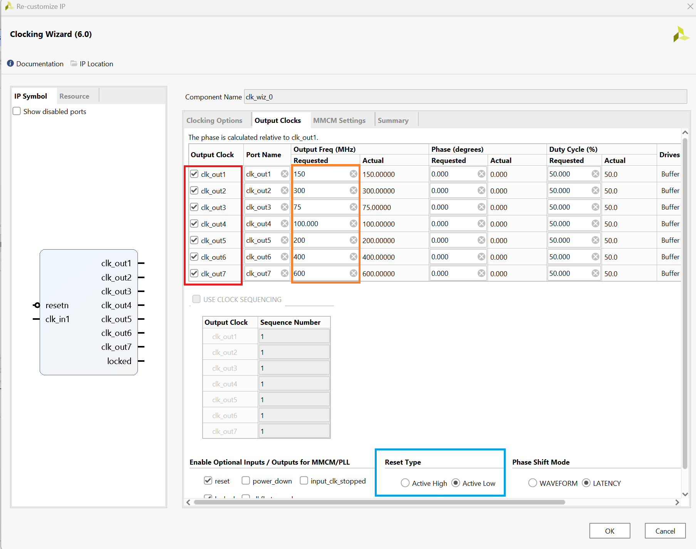

Now that the clocks have been updated, connect each clock to one processor system reset slowest clk input pin.

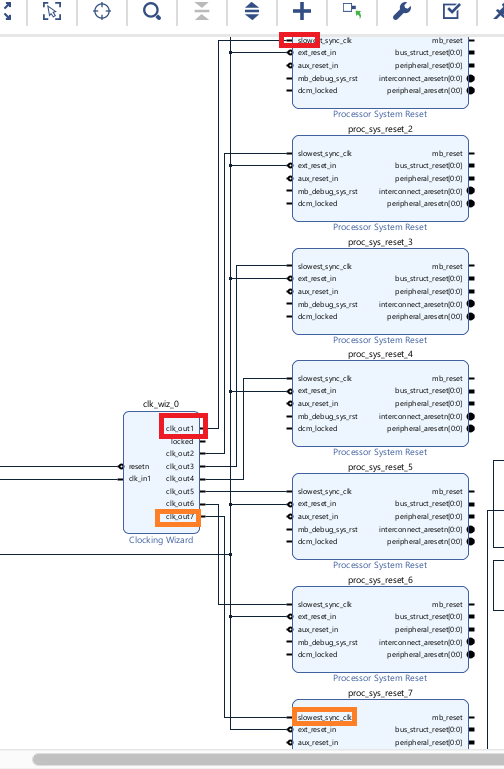

There is no need to connect the reset as we will use the automation tool to do it for us.

Now we have to swap the master axi of ZYNQ as the DPU will occupy the FPD0 slot. To do so double click on the zynq slot and head over to ps-pl configurations.

Then follow the below picture to swap them. Make sure to reconnect the master and slave ports after doing so.

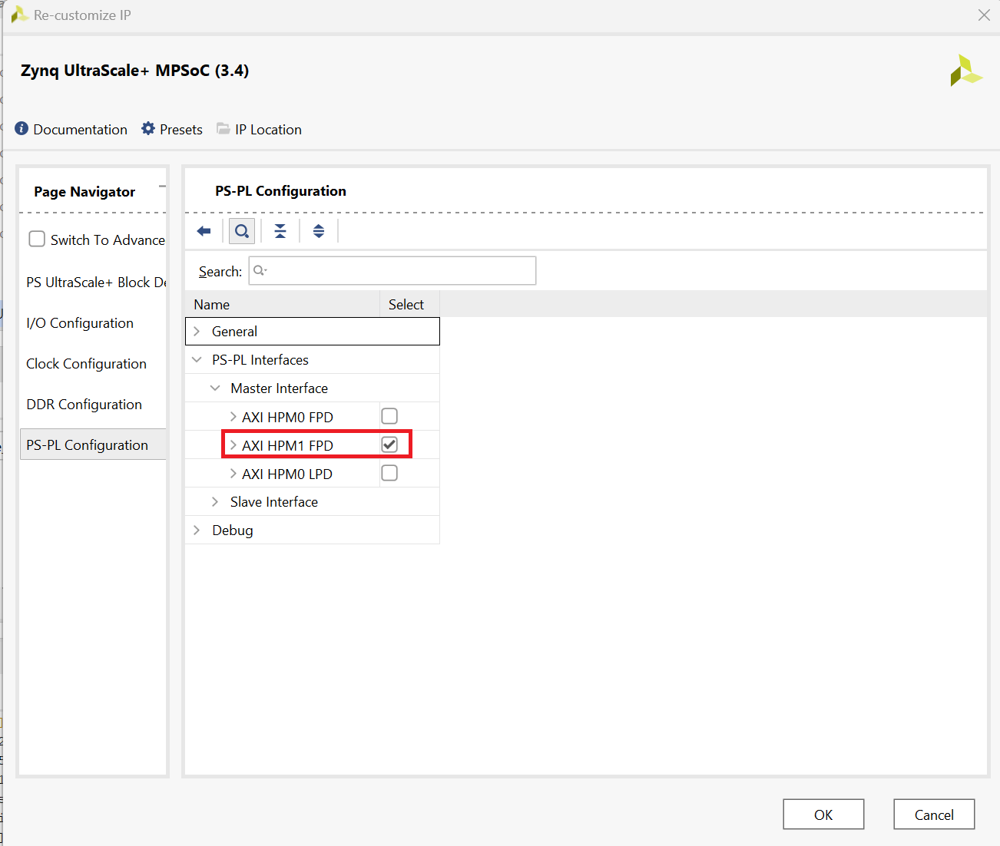

Finally click the clock automation tool select all then click ok. This should help you automatically wire all the clocks and resets to their respective locations.

Before we proceed we nned to add identification tags to the PS-PL ports and clocks. 

To do so first we have to go to settings, general and enable project is an extensible Vitis platform.

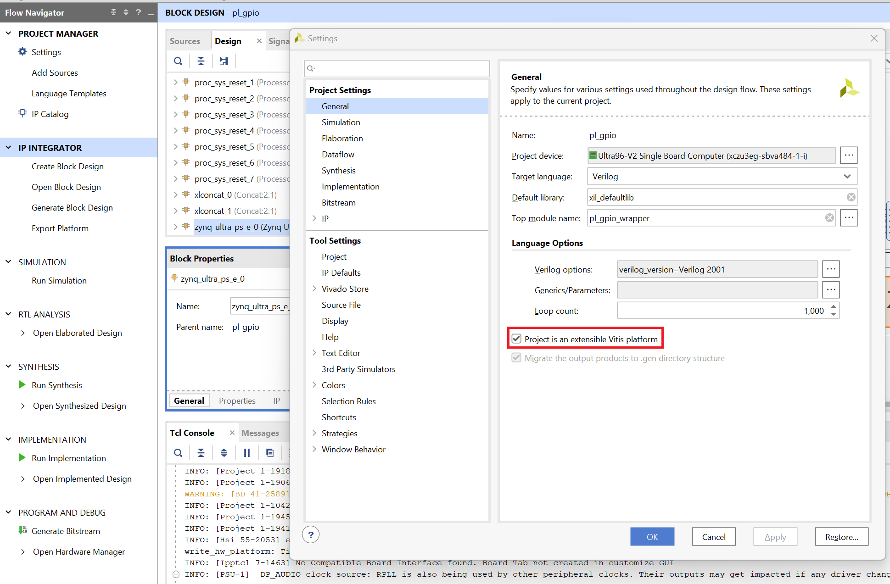

Then go to windows and select platform setup.

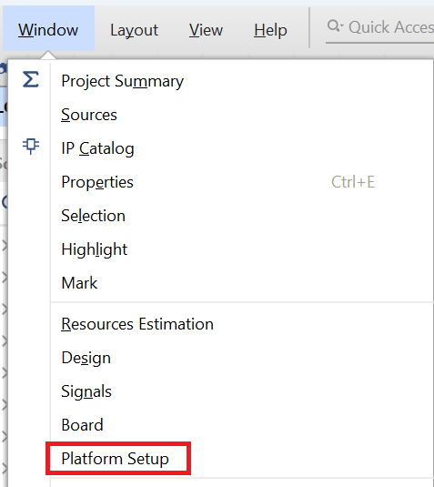

In platform setup first go to clock and enable all the clocks in the clocking wizard section. Leave zynq clk disabled.

Then Give the clks an id from 0-6 like the following. Set clk_out4 aas deafult (100mhz).

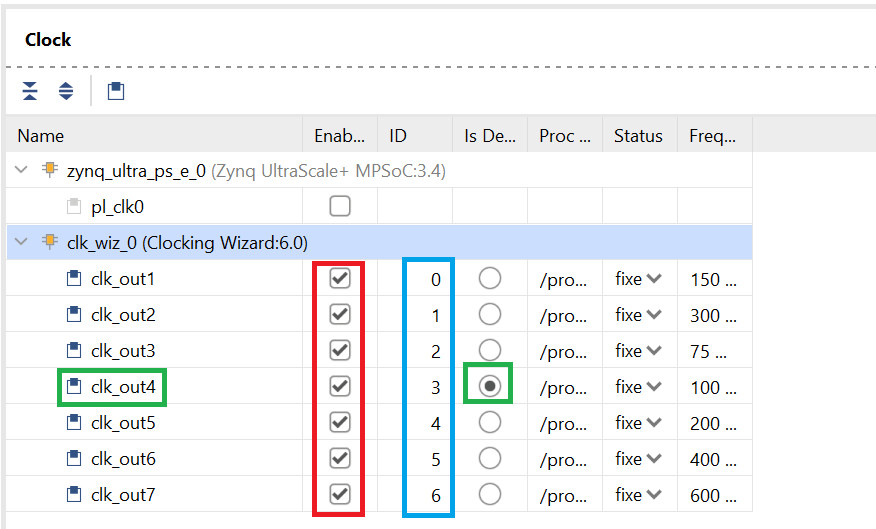

Now got to Axi Port, enable all of them except S_AXI_LPD leave that disabled.

Give each of them a sp tag. Follow the image for more details.

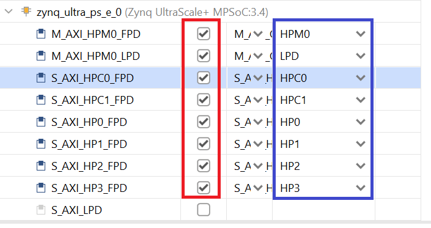

Then now that we are done, select generate block design on the left. 

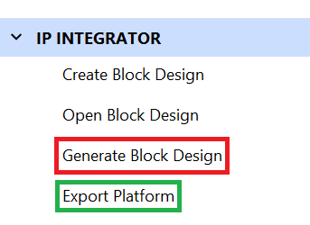

Then select export platform once you are done.

Select the last option both hardware and emulation

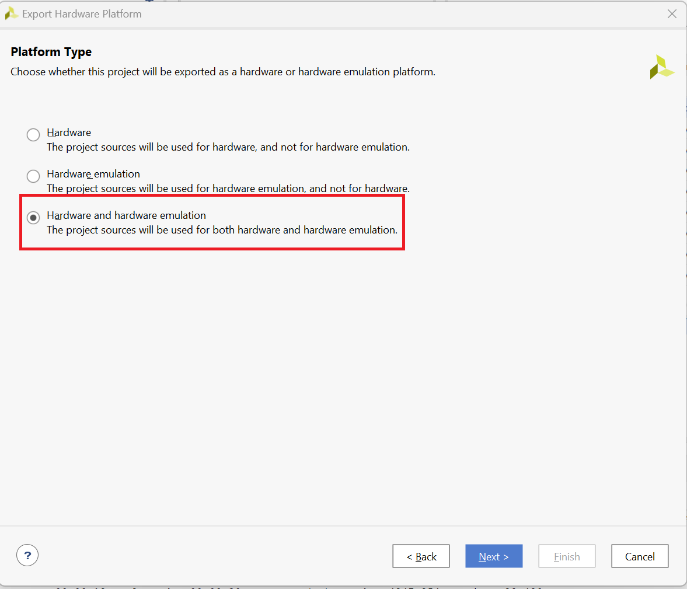

Then select pre synthesis.

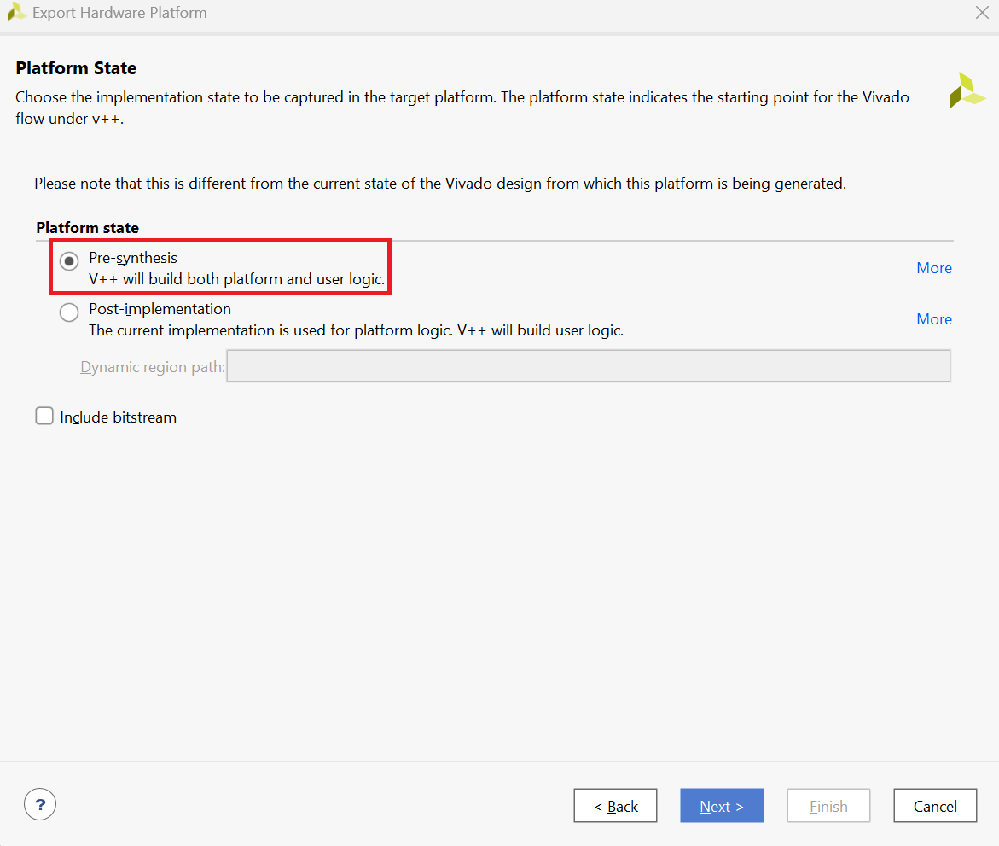

Follow the remaining steps and give the platform a name. 

Click Finish once you are done.

## Generating the xpfm file using Vitis

To generate the xpfm, first start a new platform project.

Give it a name.

Select your xsa file. Incase you haven't added to the direcotry please add it.

Uncheck generate boot components and change the OS to linux.

Click finish

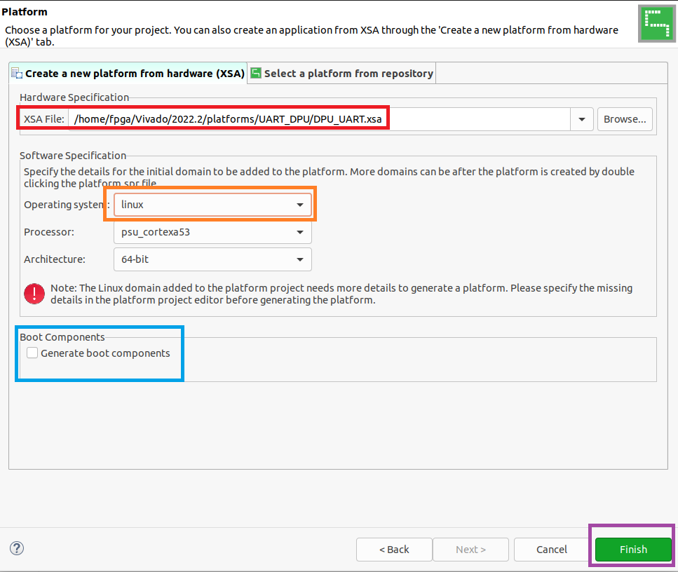

Then select the hammer icon to build the xpfm file.

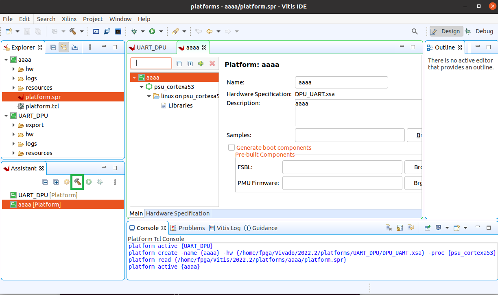

## Generating the Bitstream

Once the project has been built note the correct directory of the xpfm file as we will need it.

Then download the DPU-PYNQ library from github using

```bash
git clone https://github.com/Xilinx/DPU-PYNQ.git
```

Then go inside to the boards directory and download the board files

```bash
git clone git clone https://github.com/Xilinx/XilinxBoardStore -b 2022.2
```

Make sure it matches your vivado and vitis version.

Then if your Vitis version is not 2022.1 we will need to modify the check env script to check for 2022.2 instead of 2022.1.

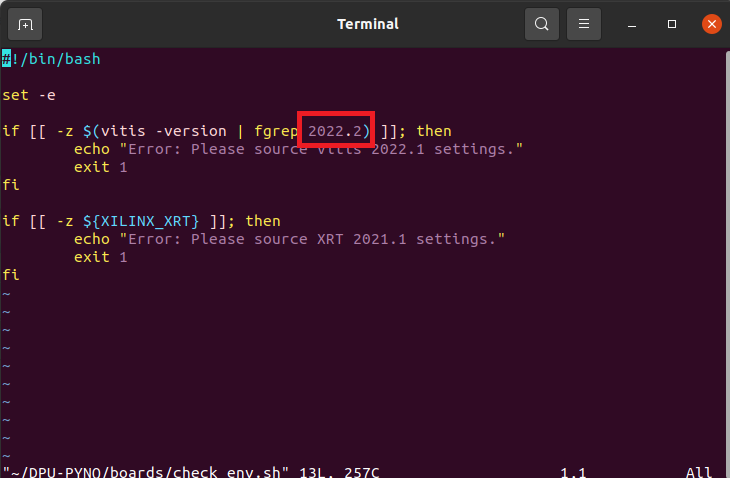

Please change the number highlighted in the image to your version.

Then finally run the following script

```bash
make BOARD=Ultra96v2 VITIS_PLATFORM=/home/fpga/Vitis/2022.2/platforms/UART_DPU/export/UART_DPU/UART_DPU.xpfm
```

Replace the path to vitis platform with your path.

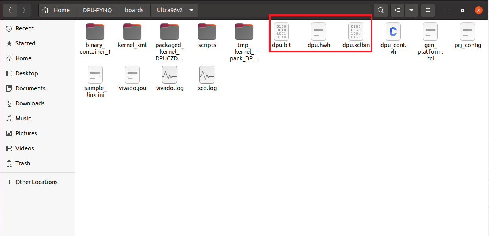

The outcome should be something like this.

Please not you need all those files on PYNQ when running the DPU Overlay function.

