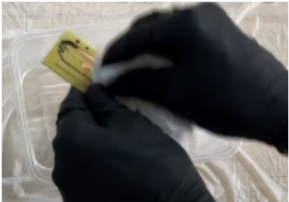

# PCB Etching Lab Manual

## A. Objective:
- To familiarize yourself with the process of chemical etching.
- To obtain a fully etched PCB without any defects.
- To identify the benefits and drawbacks of chemical etching.

## B. Materials and Equipment:
### Materials:
- Printer
- Laminator
- PCB paper
- Tissue
- Beaker
- Plastic container
- Tweezer
- Spatula
- PCB

### Safety Equipment:
- Nitrile gloves
- Safety goggles
- Plastic tablecloth
- Apron

### Chemicals:
- 40g Etchant
- 200mL Water

## C. Safety:
- Always wear nitrile gloves, safety goggles, and an apron when working with chemicals.
- Pay attention when handling hot items such as laminator, hot water, etching solution, PCB.
- Do not shake the box too vigorously to prevent spillage.
- Wash hands thoroughly if the etching solution touches your skin.
- Personal protective equipment (PPE) required: Apron, safety goggles, closed-toe shoes, gloves.
- Work in a well-ventilated area to avoid inhaling fumes or vapors.
- In case of accidental exposure, flush the affected area with water and seek medical attention immediately.

## D. Set-Up:
To prepare for the PCB fabrication process, it is important to have the necessary materials and equipment ready. These include: 
- Printer
- Laminator
- PCB paper
- Tissue
- Beaker
- Plastic containers
- Tweezers
- Spatula
- PCB
- Safety equipment (nitrile gloves, safety goggles, apron)

To ensure a safe and clean workspace, it is recommended to cover the table with a plastic tablecloth before beginning the etching process. In addition, it is necessary to prepare three plastic boxes, one of which should be filled with tap water. The other two boxes can be used for etching and cleaning the ink of the PCB. It is also recommended to have hot water on hand to aid in the etching process.

## E. Etching Process:
Wear appropriate safety equipment, including nitrile gloves, safety goggles, and an apron. Tie up long hair.

1. Add the design onto the PCB by following these steps: 
   - Heat up the laminator using the red button on the right.
   - Set the temperature to 170°C and wait for it to heat up.
   - Run the PCB through the laminator at least five times.
   - Peel off the paper when completed.

2. Prepare the etching solution by following these steps: 
   - Add a plastic tablecloth to the table.
   - Add 200mL of hot water to a plastic box.
   - Add 40g of etchant to the plastic box.
   - Stir the etchant until it has fully dissolved.

3. Start the etching process by following these steps: 
   - Using a spatula, add the PCB to the etching solution.
   - Cover the box tightly with its lid.
   - Lift the container from the top and shake it sideways to allow the flow of the etchant.

4. After all the copper has been etched, follow these steps: 
   - Using a spatula, remove the PCB from the etching solution.
   - Transfer the PCB to a box with water.
   - Rinse the PCB and transfer it to tissue.
   - Fully dry the PCB using the tissue.

5. To remove any remaining ink, follow these steps: 
   - Add a thinner into a box.
   - Dip some tissue into the thinner.
   - Wipe the PCB until all the ink comes off.

## F. Checking PCB:
After etching it is important to verify the tracks of the PCB to ensure there are no shorts or open circuits which may ruin and make the PCB unable to work. Compare your PCB to the following images and look for any potential issues.

As shown in red there is a short in the PCB which would cause the circuit to burn up and as shown in blue there is an open circuit which would not allow for any current to pass to the area of the circuit. Therefore, this PCB is not functional.