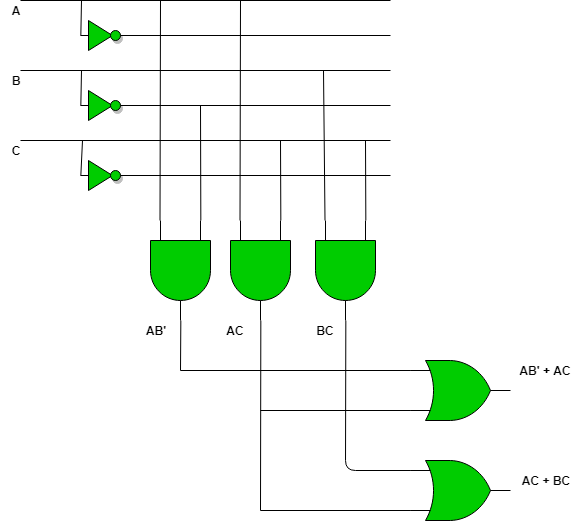
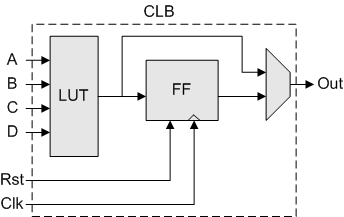

# Introduction to FPGA

  
## Introduction to Electronic Circuit
Electronic Circuit in general can be divided into 2 main catogories: analogue circuit and digital circuit.

### Analogue circuit
An analog circuit processes and manipulates **continuous** electronic signals, uses components such as resistors, capacitors, inductors and transistors.

Example: Power modules, Amplifier, Radio Frequency Appplication Circuit

### Digital circuit
A digital circuit processes **discrete** signals represented by binary digits (0s and 1s)
It uses components such as logic gates, flip-flops, and registers, which is alos mainly contrusted by transistors.

Example: Microprocessor, Digital Signal Processor, Graphical Processing Unit(GPU), Programmable Logic Device

In this course, we will discuss mainly on digital circuit.

## Common Circuit vs Integrated Circuit

**Common circuit** is built using **discrete electronic components** like resistors, capacitors, transistors, and other components. These components are individually assembled and interconnected on a PCB (Printed Circuit Board) or breadboard.

**Integrated circuit** or **Chip** is a **single semiconductor device** that integrates multiple electronic components, such as transistors, resistors, capacitors, and interconnections. ICs are fabricated using various semiconductor manufacturing processes, such as photolithography and chemical vapor deposition.

## Foundation of Integrated Circuit - Transistor 
Transistors are semiconductor devices used to amplify or switch electronic signals and electrical power. There are two commonly used transistors: Bipolar Junction Transistor(BJT) and Metal-Oxide-Semiconductor Field-Effect Transistor(MOSFET). 

Imagine you are going to build a simple switch circuit. Surely you can use a mechanical switch. However, physical presses are required for activating or deactivating the circuit. What if pressing is not allowed or compatible in your application sceranio(e.g. the switch circuit implemented underground)?

By using transistor, we can create an electrical signal controlled "switch" circuit. The following example is done by a NPN BJT.

Example: An opened "switch" implemented by NPN BJT

Example: A closed "switch" implemented by NPN BJT

By using transistor, we can build amplifier circuit, which is the basis of **Anlogue Intergrated Circuit** , or switch circuit, which is the basis of **Digital Integrated Circuit**. 

We use multiple transistors to form differents kinds of digital logic gates, which are the basic building block from which all digital circuits and microprocessor based systems.

Example: An AND gate circuit implemented by 2 NPN BJT

## Development of Integrated Circuit

The development of Integrated Circuit and Chip can be easily illustrated by the **Scale of Integration**, meaning to distinguish how many transistors can be fitted into a defined surface area on a semiconductor material. 

| Scale of Integration |Name    |   Year  | Transistor count  | Logic gates number | Example|
|---|---|---|---|---|---|
| SSI| _small-scale integration_  | 1964  |   1 to 10 |  1 to 12 | Flip-Flops|
| MSI  | _medium-scale integration_  |  1968 | 10 to 500  |   13 to 99  |Counters|
| LSI |_large-scale integration_  |    1971 | 500 to 20 000  |  100 to 9999|Intel 4004(First mircroprocessor)|
|VLSI|_very large-scale integration_ |1980|20 000 to 1 000 000|10 000 to 99 999|System on Chip(SoC)|
|ULSI|_ultra-large-scale integration_|1984|1 000 000 and more|100 000 and more|AMD Ryzen 9|

## Programmable Logic Device(PLD)
Programmable Logic Device are digital IC with numerous digital logic gates built in. Engineers and developers can design and program the digital logic inside it using **Hardwawre Description Language(HDL)**.

### Read-Only Memory(ROM)
Before digital logic array IC, engineer tried to use ROM to represent combinational logic circuit. Electrically Erasable Programmable ROM(EEPROM) was commonly used. However, using memory device to represent digital logic circuit is slow and cost-ineffective. Thus, array circuit built by numerous interconnected logic gates is widely used for PLD instead.

### Programmable Logic Array(PLA) and Programmable Array Logic(PAL)
Both PLA and PAL consist of an AND Array and an OR Array.

Difference is:

- In a PAL, the AND array is fixed, but the OR array is programmable.

- In a PLA, both the AND and OR arrays are programmable.

PAL or PLA can be programmed by **antifuse technology(irreversible)** or EEPROM.

## Field Programmable Gate Array (FPGA)
![FPGA Design, Architecture and Applications (Updated) [2024]](https://www.logic-fruit.com/wp-content/uploads/2021/12/FPGA-Graphics-1.jpg.webp)
Based on PAL and PLA, FPGA is developed to fulfil more complex and large scale digital circuit appplication. The key feature of FPGA is "field", which means the digital circuit design can be reprogrammed outside factory, which give us greater flexible and agile in utilizing it. 

### Structure of a FPGA
1.  Logic Blocks:
    
    -   FPGAs consist of a large number of configurable logic blocks (CLBs) that can be interconnected to implement various logic functions. Each CLB typically contains Lookup Tables(LUTs), flip-flops, and multiplexers.
    
2.  Interconnect:
    
    -   The interconnect structure of an FPGA comprises a network of programmable routing resources that allow signals to be routed between the CLBs. This interconnect provides flexibility in establishing connections between different logic blocks based on the desired circuit configuration. 
    
3.  Configuration Memory:
    
    -   FPGAs use configuration memory to store the programming information that determines the functionality of the device. This memory is used to configure the interconnect resources, logic blocks, and other functional elements within the FPGA.
4.  I/O Blocks:
    
    -   Input/output blocks (IOBs) provide the interface between the internal logic of the FPGA and the external world. These blocks allow the FPGA to communicate with external devices, such as sensors, memory, or other integrated circuits.
5.  Clock Distribution:
    
    -   FPGAs have dedicated resources for distributing clock signals throughout the device. These resources help in ensuring synchronous operation of the internal logic elements and facilitate the implementation of complex synchronous designs.
6.  Embedded RAM and DSP Blocks:
    
    -   Some FPGAs include embedded memory blocks and digital signal processing (DSP) blocks to provide additional functionality for specific applications that require memory or digital signal processing capabilities. 
 
## Application Specific Integrated Circuit(ASIC)
Unlike PLA and FPGA that can be prgrammed to meet a variety use case requirements after manufacturing, ASIC designs are tailored early in the design process to address specific needs. ASIC is expensive, consume many time to develop and manufacture, thus are only used in very specific and dedeicated task in an electronic system.

It is very common for the chip engineers to use FPGA to test and evaluate a ASIC design before manufacutring the acutal ASIC.

Example: Targeted AMD ASIC dedeicated for Interactive Streaming

## General Purpose Processor 
Central Processing Unit (CPU), Microcontroller Unit (MCU) and Microprocessor are the common general purpose processors, 

Unlike PLDs, General purpose processor is designed to running large variety of general instructions to cater to the most number of scenarios as possible. Thus, many logic gates are complied together  to form defined function blocks, such as **Control Unit**(CU), **Arthmetic Logic Unit**(ALU), **Registers**.

### Working Process of General Purpose Processor 

#### 1.  **Fetch**

-   The Control Unit (CU) retrieves ("fetches") the next instruction to be executed from the main memory (RAM) and places it into the Instruction Register (IR).
-   The address of the instruction is stored in the Program Counter (PC), which is then incremented to point to the next instruction.

#### 2.  **Decode**

-   The fetched instruction is sent to the Instruction Decoder within the Control Unit.
-   The Control Unit interprets the instruction to understand what operation is to be performed and which resources are required.

#### 3.  **Execute**

-   The decoded instruction is sent to the appropriate part of the CPU. For instance, if it’s an arithmetic operation, it will be sent to the ALU.
-   The required data is fetched from the registers or memory.
-   The ALU performs the required operation (addition, subtraction, logical operations, etc.).
-   The result of the operation is stored back in a register or memory.

#### 4.  **Write Back**

-   The result of the execution stage is written back to the appropriate place, such as a register or a memory location.
-   This step updates the status registers and flags (like zero, carry, overflow) based on the result of the operation.

##  Comparison between different Digital IC

All the abovementioned digital IC can be compared in 2 parameters: Flexibility and Efficency.

As mentioned before, general purpose processor's archieture is designed to running large variety of general instructions to cater to the most number of scernios as possible. However, many steps are required for running a task in a general purpose processor, resulted in an efficiency bottleneck. 

FPGA and ASIC on the other hand, can be designed for specific repetitive application or task in a very efficient way. 

## Multiprocessor System-on-Chip(MPSoC)
Multiprocessor System-on-Chip is a technology to integrate general processor(CPU, GPU), FPGA and DSPs into one system chip. With MPSoC, engineers and developers can allow different processor to cooperate with each other. General processos can assign repetitive tasks to a dedicated processor, such as FPGA and GPU, such that they can accelerate the task. Thus, the whole system can work in faster speed and greater efficiency.
### Key Application of MPSoC:
 AI and Machine Learning, Automatives, Telecommunication
  
## Zynq® UltraScale+™ MPSoC and Ultra96

Developed by AMD Xilinx, Zynq® UltraScale+™ MPSoC combines the capabilities of a traditional FPGA in the name of "Programmable Logic" with a high-performance processing system, making it a powerful and versatile platform for a wide range of applications.

Zynq® UltraScale+™ MPSoC is used in our main course hardware: Avnet Ultra96-V2 development board. 

## AMD Xilinx Vivado

To design, implement and verify digital logic circuits for the Programmable Logic in Zynq® UltraScale+™ MPSoC or Xilinx FPGA , Xilinx Vivado design suite is primarily used. 
### Key Features and capabilities of the AMD Vivado
1.  Integrated Design Environment (IDE):
2.  High-Level Synthesis (HLS)
3.  IP Integrator
4.  Implementation and Optimization
5.  Verification and Debugging
   
## PYNQ

PYNQ stands for Python Productivity for Zynq. It is an open-source project that enables programming MPSoCs with Python.

A great tool for prototyping and exploring FPGA designs using a high-level language like Python.

## Initializing PYNQ on Ultra96
Follow the documentation to connect Ultra96 to your computer:
https://ultra96-pynq.readthedocs.io/en/latest/getting_started.html
In your browser, connect to http://192.168.3.1/. Enter Login password: **xilinx** to start using Jupyter notebook.

## Using Juypter Notebook in PYNQ

Juypter Notebook is used as the GUI IDE for PYNQ. Juypter Notebook support running Python notebook and Linux terminal. 

### Open and Run a Displayport example notebook 
1. Connect MiniDisplayport to DP-to-HDMI convertor, HDMI cable and HDMI Video Capture card
2. Connect HDMI Video Capture card to **your computer's** USB port
3. Connect the Webcam to **Ultra96's** USB port
4. Open "common" folder
5. In "common" folder, open "display_port_introduction.ipynb" notebook

6. Make sure you connect everything properly and open the "Camera" application in your computer.

8. Run the whole notebook to display camera output to your computer

### Using Linux Terminal in Juypter Notebook in PYNQ
Go back to Homepage. Initialize a new terminal by pressing New > Terminal.

### Common Linux Command
1.  `ls`: Lists the contents of a directory.
2.  `cd`: Changes the current working directory.
3.  `mkdir`: Creates a new directory.
4.  `rm`: Removes (deletes) files or directories.
5.  `cp`: Copies files or directories.
6.  `mv`: Moves or renames files or directories.
7.  `cat`: Displays the contents of a file.
8.  `nano`: A text editor for editing files.
9.  `ssh`: Connects to a remote machine via Secure Shell (SSH).
10.  `chmod`: Changes the permissions of a file or directory.
11.  `sudo`: Executes a command with superuser (administrative) privileges.
12.  `grep`: Searches for a pattern in a file or output.
13.  `top`: Displays the running processes and their system resource usage.
14.  `apt-get`: The package manager for Debian-based Linux distributions (e.g., Ubuntu).
15.  `systemctl`: Manages system services (start, stop, enable, disable).