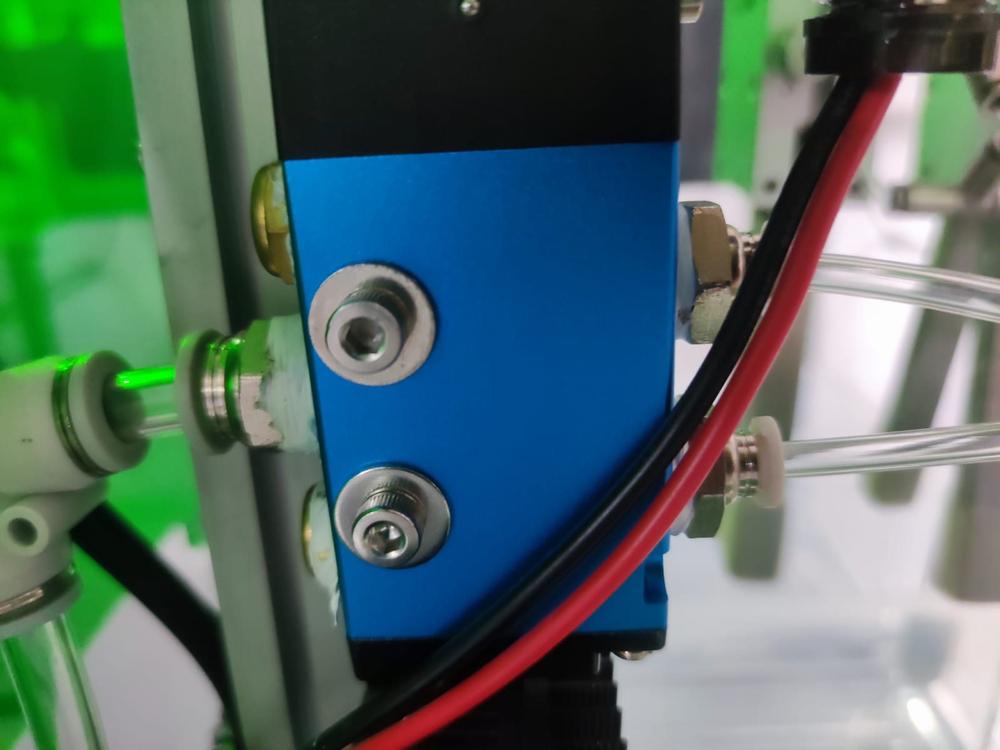
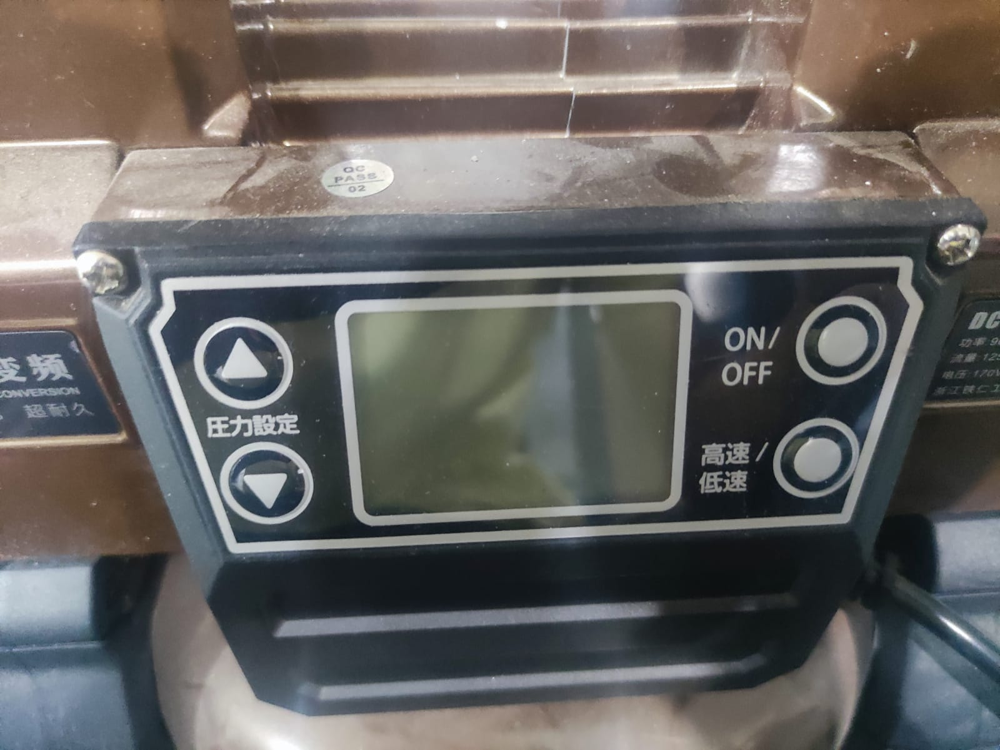

## Required Materials:

- L brackets: L brackets are used for providing structural support and stability. They can be attached to various components using screws to create sturdy connections.

- Corner L-Bracket: Corner L-brackets have a 90-degree angle and are specifically designed for reinforcing and stabilizing the corners of an assembly. Their benefits include:
   - Corner Reinforcement: Corner L-brackets provide additional strength and stability to corner joints, which are typically more susceptible to stress and movement. They help prevent corner separation or shifting, ensuring the longevity of the assembly.
   - Load Distribution: By transferring the load from one surface to another, corner L-brackets distribute the stress and prevent concentrated forces at the corners. This helps minimize the risk of damage or failure.

- Nuts: Nuts are typically used in conjunction with screws. They are inserted onto the screw threads and tightened to secure components together.

Rectangular Nuts: Rectangular nuts, also known as square nuts, can also contribute to the stability and longevity of an assembly. Here are some advantages of rectangular nuts:

- Secure Fastening: Rectangular nuts offer a secure fastening mechanism when used with bolts or threaded rods. They provide a strong and reliable connection, enhancing the stability of the assembly.
- Prevents Rotation: The shape of rectangular nuts prevents them from rotating when tightened, ensuring that the nut stays in place and maintains the desired tension.
- Alignment Assistance: The flat sides of rectangular nuts make it easier to align and position them during installation, ensuring proper engagement with the bolt or threaded rod.
- Suitable for Tight Spaces: Rectangular nuts are often used in applications where there is limited space or a need for a low-profile nut, as they can be flush-mounted or embedded in the assembly.

- Screws: Screws are versatile fasteners used to join different parts together. They can be inserted into pre-drilled holes and tightened using a screwdriver or a hex key.

Here are a few examples of screw head types and their advantages in terms of stability and longevity:

**Phillips Head**: Phillips head screws have a cross-shaped recess, and they are widely used in various applications. Their advantages include:
- Ease of Use: The design of the Phillips head allows for easy engagement with a Phillips screwdriver, reducing the risk of slipping during installation.
- Increased Torque Transfer: The Phillips head design provides good torque transfer, allowing for efficient tightening without damaging the screw head.

**Torx Head**: Torx head screws have a star-shaped recess with six points (sometimes with additional points for higher torque capacity). The benefits of Torx head screws include:
- High Torque Transfer: The star-shaped recess provides a larger contact area between the screwdriver and the screw, enabling higher torque transfer and reducing the risk of cam-out (the screwdriver slipping out of the recess).
- Reduced Risk of Stripping: The design of Torx screws reduces the likelihood of stripping the screw head, making them suitable for applications that require frequent assembly and disassembly.

**Allen/Hex Head**: Allen or hex head screws have a hexagonal recess and are driven using hex keys or Allen wrenches. Their advantages include:
- High Torque Transfer: The hexagonal shape of the recess allows for increased torque transfer, enabling tighter fastening without the risk of stripping.
- Space-Conscious Design: The recessed hexagonal shape allows for a low-profile screw head, making hex head screws suitable for applications with limited space.

**Square Head**: Square head screws have a square-shaped recess and are commonly used in woodworking applications. Their advantages include:
- Enhanced Grip: The square-shaped recess provides a good grip, reducing the risk of slipping during installation or removal.
- Reduced Cam-Out: The square head design reduces the likelihood of cam-out, ensuring better engagement between the screwdriver and the screw.

**One-Way Head**: One-way screws have a unique head design that allows them to be easily installed but difficult to remove using conventional tools. Their advantages include:
- Increased Security: One-way screws provide an added level of security, as they cannot be easily removed without specialized tools.
- Tamper Resistance: The design of one-way screws discourages tampering or unauthorized removal, making them suitable for applications where security is a concern.

- Hex keys: Hex keys, also known as Allen keys, are tools with a hexagonal-shaped tip. They are used to tighten or loosen screws with hexagonal socket heads.

- Aluminium extrusion: Aluminium extrusions are long, hollow profiles made of aluminum. They are commonly used in building frames, structures, and framework for various applications.

- Structural Aluminum Extrusion:
   - Heavy-Duty Applications: Structural aluminum extrusions are specifically designed for heavy-duty applications that require high load-bearing capacity. They are ideal for constructing robust and durable assemblies that can withstand substantial forces and stresses.
   - Rigidity and Strength: Structural extrusions have thicker walls and larger cross-sectional profiles, providing enhanced rigidity and strength. This allows them to handle heavier loads and resist deformation, ensuring the stability and longevity of the assembly.
   - Design Flexibility: Like standard extrusions, structural extrusions offer design flexibility with various profile options. They can be easily combined or integrated with other extrusions or components to create customized and efficient structures.

- Acrylic: Acrylic is a versatile and transparent plastic material. It is commonly used for various applications, including protective covers, signage, and display panels.

- Washers: Washers are thin, flat discs typically made of metal or plastic. They are placed under the head of a screw or between the screw and the surface being fastened. Washers distribute the load and provide a smooth surface, preventing damage or loosening of the joint.

Different types of washers play a crucial role in enhancing the stability and longevity of an assembly in various ways:

**Flat Washers**: Flat washers, also known as plain washers, are the most common type of washer. They are typically circular with a hole in the center. Flat washers serve several purposes, including:

- **Load Distribution**: When a screw or bolt is tightened, the flat washer distributes the load evenly over a larger surface area, reducing the risk of damage to the object being fastened.
- **Protection**: Flat washers act as a protective barrier between the screw head or nut and the surface of the object. They help prevent surface damage, such as scratches or deformation.
- **Anti-vibration**: Flat washers can absorb vibrations and reduce the likelihood of loosening due to mechanical vibrations or thermal expansion and contraction.

## How to Use an L Bracket with Nuts and Washers

1. Determine the placement: Identify the two components or surfaces that you want to join using the L bracket.

2. Slot the nuts into the aluminium extrusion: Calculate the number of nuts required for each extrusion before screwing in any screws or L brackets. Insert the nuts into the appropriate holes in the aluminium extrusion. Ensure that the nuts fit securely.

3. Position the L bracket: Hold the L bracket against one of the components, aligning the holes or slots in the bracket with the corresponding nuts.

4. Insert screws with washers: Place a washer on each screw, then insert the screws through the holes in the L bracket and into the nut holes in the aluminium extrusion. Make sure the screws are long enough to securely fasten the bracket to the component. Then tighten the screw by srewing in clockwise. To untighten, screw out in the counterclockwise direction.

5. Align the second component: Hold the second component in place, aligning it with the L bracket. Ensure that the holes or slots in the second component align with the remaining holes or slots in the L bracket.

6. Secure the second component: Insert screws through the remaining holes in the L bracket and into the nuts in the second component. Tighten the screws using a screwdriver or a hex key.

7. Check the stability: Ensure that the L bracket provides the desired structural support and stability between the two components. Make any necessary adjustments or tighten the screws further if needed.

# Building a 3D Cube Assignment

## Objective
Build a 3D cube using aluminum extrusions, screws, nuts, hex keys, and L-brackets.

## Materials Provided
- Aluminum extrusions (6 pieces)
- Screws
- Nuts
- Hex keys
- L-brackets (8 pieces)

## Instructions
Follow the step-by-step guide below to complete the assignment:

1. **Gather the Materials**
   - Ensure that you have all the necessary materials listed above.

2. **Prepare the Aluminum Extrusions**
   - Prepare the aluminimun extrusions. These will serve as the edges of the cube.

3. **Assemble the Base**
   - Take two aluminum extrusions and connect them at a right angle using L-brackets at each corner.
   - Use screws and nuts to secure the L-brackets to the extrusions.
   - Repeat this step to create a total of four L-shaped base corners.

4. **Connect the Base Corners**
   - Connect the four L-shaped base corners together to form a square.
   - Attach L-brackets at each corner and secure them with screws, washers and nuts.

5. **Attach the Top Edges**
   - Take the remaining two aluminum extrusions and attach them to the top of the base corners.
   - Use L-brackets, screws, and nuts to secure the top edges to the base corners.

6. **Check and Adjust**
   - Ensure that all the connections are secure and the cube is stable.
   - Use a hex key to tighten any loose screws if necessary.

7. **Finishing Touches**
   - Double-check the cube for any loose connections or wobbling.
   - Make any necessary adjustments and tighten all the screws.

## How to Use Pneumatics for Clamps

1. Connect the pneumatic system: Ensure that the pipe is correctly connected to the pneumatic controller before turning on the pump. This connection ensures the flow of pressurized gas to the system.

2. Pneumatic controller components:
   - The gold piece: Press this to check if there is pressurized gas inside the pump. It acts as a pressure indicator.
   - The center piece: Pull down the center piece and rotate it clockwise to increase the output pressure. It is recommended to set it to 0.2MPa (as indicated by the black label). Once set, push it back up to secure the desired pressure. To reset it to 0, pull down the center piece and rotate it counterclockwise before pushing it back up.

Opened: Can rotate

Closed: Cannot rotate 

   - The right side opening: This opening is meant for the output valve and should be connected to the pneumatic controller. Ensure a secure connection for proper operation.

3. Inserting the pipe into the pneumatic controller: To properly insert the pipe into the pneumatic controller, push in the white ring while inserting the tube. This ensures a tight and secure connection.

4. Connecting the clamp:
   - Identify the correct side of the clamp: Look for labels such as "S" and "O" on the clamp. Ensure the appropriate side is connected based on your specific clamp model and requirements.
   
   

   - As seen in the picture, there are 2 clamps connected parallely. This is simila0r to electronics where the current gets split in parallel connections however the voltage in this case the air remains the same.

   - Connect the output of the pneumatic controller: Connect the normal open (NO) or normal close (NC) output of the pneumatic controller to the corresponding input of the clamp. This connection allows the controlled flow of pressurized gas to the clamp.
   - At the pneumatic controller, there is a overide switch which can be pushed to change the airflow from normal open to normal close

    
   

   When the valve is at rest position, the air flows from B->S and P->A while R is closed noted by the T symbol.
   When the valve is on, the air flows from A -> R and P -> B while S is closed as denoted by the T symbol.
 
   So wire the solenoid valve accordingly based on whether you want you clamp to be normal open or normal closed by chosing the air flow from P to A where A is the O on the clamp which stands for open. For normal closed it would be instead S.

5. Operating the pump: Click on the pump to start it. This will initiate the pumping process, delivering pressurized gas to the pneumatic system and activating the clamp.

 

# Air Pump and Solenoid Valve Assignment

## Objective
Assemble and operate a system using an air pump with a pressure controller, solenoid valve for air, and clamps to control airflow.

## Materials Provided
- Air pump with pressure controller
- Solenoid valve for air
- Clamps
- Tubing
- Power supply
- Mounting brackets (if necessary)

## Instructions
Follow the step-by-step guide below to complete the assignment:

1. **Gather the Materials**
   - Ensure that you have all the necessary materials listed above.

2. **Mount the Air Pump and Solenoid Valve**
   - Decide on the desired location for the air pump and solenoid valve in your setup.
   - Use the provided mounting brackets or other suitable methods to securely mount the air pump and solenoid valve in place.

3. **Connect the Tubing**
   - Identify the air inlet and outlet ports on the pump, pressure controller, and solenoid valve.
   - Attach tubing to the outlet port of the air pump, and secure it with clamps.
   - Connect the other end of the tubing to the inlet port of the pressure controller, and secure it with clamps.
   - Attach another length of tubing to the outlet port of the pressure controller, and secure it with clamps.
   - Connect the free end of the tubing to the inlet port of the solenoid valve, and secure it with clamps.
   - Attach another length of tubing to the outlet port of the solenoid valve, and secure it with clamps.
   - Position the free end of the tubing to the desired location for airflow discharge.

4. **Power Supply Connection**
   - Connect the power supply to the air pump, pressure controller, and solenoid valve according to the manufacturer's instructions.
   - Ensure that the power supply is compatible with the voltage requirements of all components.

5. **Test the System**
   - Turn on the power supply and activate the air pump.
   - Adjust the pressure controller to the desired pressure level.
   - Verify that the air pump is running smoothly and maintaining the set pressure.
   - Activate the solenoid valve to control the airflow. Observe changes in airflow when the valve is opened or closed.