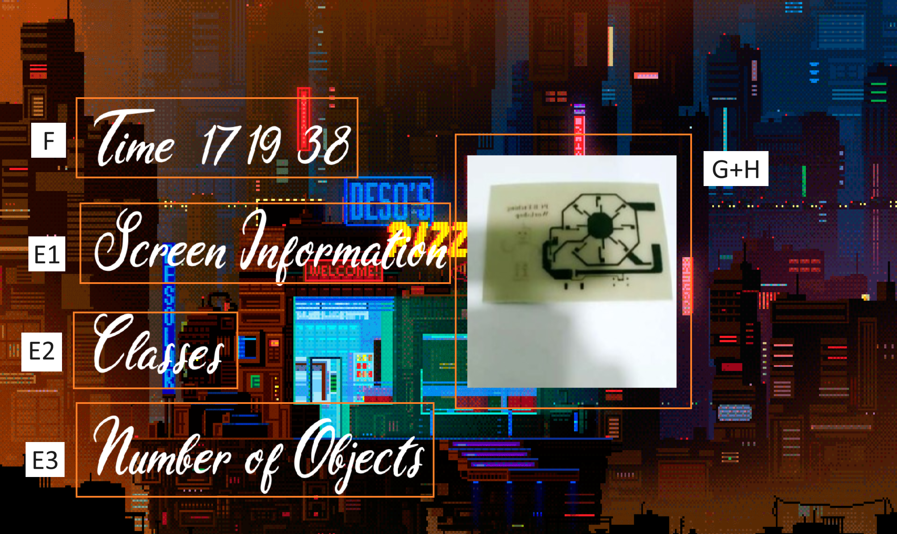

# Animated UI with Custom Font

## Set up new folder
Create a new folder inside the python folder called `UI_Design`.
All of the code here should be saved there

Make sure to open the correct folder on VScode before starting any of the code.
Also make sure to save the file if you want to try out the programs yourself

This code creates an animated user interface (UI) using OpenCV. It displays a GIF animation and overlays text elements on top of it using a custom font. The UI also includes a static image that can be zoomed in and out. The code utilizes the PIL library to handle the custom font rendering.

## OpenCV Basics

Firstly before beginning incase you have not installed opencv, please do so by following the steps below

1. On VScode, open a new terminal
2. Type `pip install opencv-python` inside the terminal
3. If it installs correctly you should receive no errors

Now that we have opencv installed, create a new file called `opencv_basics.py`

Inside the file, first we have to import opencv

To do so type the following code

```python
import cv2
```

What this does is lets the computer know we want to access the functions in opencv

Now that we have imported cv2, let's go through some basic functions to load, show and save images.

there are 3 functions which we will use

### 1. `cv2.imread()`

The imread function allows us to open an image an load it into a variable in python

It is the most common way to load an image for further processing


### 2. `cv2.imshow()`

The imshow() function is used to display the loaded image into a window.

It allows you to visualize the image as well as any changes you may apply to it using other functions.


### 3. `cv2.imwrite()`

The imwrite function is used to save the image you provide it and is usually used to save images which have undergone some changes through other functions so that it can be sent else where.

These are the basic operations to be used to load, show and save images.

Here's an example which combines the three functions into a1 program

```python
import cv2

# Read the image
image = cv2.imread('4.jpg') # todo replace the string with the name of your image

# Display the original image
cv2.imshow('Original Image', image) # Original Image is the title of the cv2 image variable is the image being displayed
cv2.waitKey(0)

# Convert the image to grayscale
gray_image = cv2.cvtColor(image, cv2.COLOR_BGR2GRAY) #BGR2Gray is a cv2 function changing the colour scale to gray scale (different shades of black and white)

# Write the grayscale image to a file
cv2.imwrite('grey_4.jpg', gray_image) # writes a file with variable gray_image and gives it a name grey_5.jpg

# Display the grayscale image
cv2.imshow('Grayscale Image', gray_image) # Grayscale Image is the title of the cv2 image variable is the gray_image being displayed
cv2.waitKey(0)

# Close all windows
cv2.destroyAllWindows()

```

In the following code, we read an image using `imread` called `5` and display the image using `imshow`

We wait for a key to be pressed using `waitKey` afterwhich the image is turned grey using `cvtColor`.

The image is saved using `imwrite` and displayed again using `imshow`

Finally once a key is pressed, we destroy all windows using `destroyAllWindows` and the program ends.

## Processing images

Now that we have been able to load the images how about changing the size and colour of the image?

3 new operations will be introduced in order to manipulate the images.

### 1.  Resizing

the resize function `cv2.resize()` takes in the image, the width and the height which should be integers and utilizes them to resize the image

example
```python
import cv2
image = cv2.imread("3.jpg")

#get the height and width
height, width = image.shape[:2] # a image has 3 dimension height width and rgb scale
resized_image = cv2.resize(image, (int(width/2), int(height/2))) # cv2.rezie needs int so we convert the divided amount to an int to avoid errors
# Display the adjusted image
cv2.imshow('Adjusted Image', resized_image)

cv2.waitKey(0)  # Wait until a key is pressed
cv2.destroyAllWindows()
```

In this example, first we get the width and height of the image using image.shape[:2]

This is because the image has a shape (height, width, channels) and by using [:2] we retreive the first two elements from the numpy array

Once we have this info, we can resize the image in half by using `cv2.resize` and divide the width and height by 2 as seen in the example

The waitkey is used to wait until a key is pressed before continuing the program

However in this case once a key is pressed, the function destroyallwindows deletes the window then the program ends.

### 2. Cropping Images

Cropping images is not done by using array slicing

What this means is we use array accessing method [] with the start number, end number not including that number
for example [1:45] this means we access elements 1 all the way to element 44

To use this to crop images, you can try the following code

```python
import cv2
image = cv2.imread("3.jpg")

# Crop a region of interest (ROI) from the image
x, y, w, h = 100, 100, 200, 200 # try changing these numbers and see the output image
cropped_image = image[y:y+h, x:x+w] # make sure your values are in the range of your image pixels

# Display the adjusted image
cv2.imshow('Cropped_Image', cropped_image)

cv2.waitKey(0)  # Wait until a key is pressed
cv2.destroyAllWindows()

```

Here, the 100 to 299 pixels are removed out from the width and height respectively to result in an image of 300x300 pixels

Remember the shape of the image is (width, height, channels) so by using [y:y+h, x:x+w] we are accessing the first 2 elements in the shape array before extracting their respective pixels out.

### 3. Rotating Images

Now unlike the first 2 image manipulation techniques, rotating images is slightly more complicated due to how arrays work.

Like previously we will need the image width and image height

We can use that to find the center of the image by dividing by 2

We will also choose the rotation angle

Once we have them, we will use the `getRotationMatrix2D` to calculate the rotation filter before applying it through `warpAffine` to give us the rotated image

Here is a sample code on how to execute it

```python
import cv2

# Read the image
image = cv2.imread('4.jpg') # make sure you modify this to your image if needed

# Get the image dimensions
height, width = image.shape[:2] # we learned this earlier

# Define the rotation angle in degrees
angle = 180 # try changing this and see the result

# Define the rotation center
center = (width / 2, height / 2) # You can try to modify this as well

# Calculate the rotation matrix
rotation_matrix = cv2.getRotationMatrix2D(center, angle, 1) # try changing 1 to another integer see the result

# Apply the affine transformation
rotated_image = cv2.warpAffine(image, rotation_matrix, (width, height))

# Display the rotated image
cv2.imshow('Rotated Image', rotated_image)
cv2.waitKey(0)
cv2.destroyAllWindows()
```
As you can see, `getRotationMatrix2D` has inputs center which is the center (x,y) of the image, the rotation angle and scale which is 1.

If you want to zoom in and out, you can adjust the scale accordingly

One thing to note is although opencv does provide a `rotate` function, it can only rotate certain angles which is why the above method is taught.

You can decide to make your own function if you want to use the above rotation code.

## Drawing and Annotations:

### Drawing 
This section will discuss how you can add texts and shapes onto your image.

#### Adding shapes

OpenCV supports the addition of many shapes onto images such as circles rectangles etc.
If you want other shapes feel free to google the function and how it works or ask chatgpt.

Here is some examples on how to use them

```python
import cv2
import numpy as np

# Create a blank image
image = np.zeros((400, 400, 3), dtype=np.uint8) # 400x400x3 pixels

# Draw a line
cv2.line(image, (50, 50), (350, 50), (0, 255, 0), 2) # start point is (50,50) end is (350,50) colour is (0,255,0) 2 is the thickness of the line

# Draw a rectangle
cv2.rectangle(image, (50, 100), (200, 250), (0, 0, 255), 3) # starting corner bottom left (50,100) end corner top right (200,250) , colour (0,0,255), thickness 3

# Draw a filled rectangle
cv2.rectangle(image, (250, 100), (350, 250), (0, 0, 255), -1) # starting corner bottom left (250,100) end corner top right (300,250) , colour (0,0,255), fills the rectangle with the color

# Draw a circle
cv2.circle(image, (150, 300), 50, (255, 0, 0), 2) # center (150,300) 50 is the radius, (255,0,0) is the colour 2 is the thickness

# Draw a filled circle
cv2.circle(image, (300, 300), 50, (255, 0, 0), -1) # center (150,300) 50 is the radius, (255,0,0) is the colour, -1 is to fill the circle

# Draw a filled polygon
points = np.array([[50, 350], [150, 350], [200, 300], [250, 350], [350, 350]], np.int32)
cv2.fillPoly(image, [points], (0, 255, 255))

# Display the image
cv2.imshow('Image', image)
cv2.waitKey(0)
cv2.destroyAllWindows()
```

In the example above, there are 5 different ways to draw shapes. If you want to use a particular one for demo purposes feel free to comment the rest using # or ''' ''' as taught in the pythons basic course

### 1. line

To draw a line, you can use the `line` function: 

it has the following parameters: 

- the input `image`

- the `starting (x,y)` 

- the `ending (x,y)` 

- the `colour` in b g r 

- the `thickness` of the line which has to be `an int` > 0 in this case

### 2. Rectangle

To draw a rectangle you can use the `rectangle` function:

it has the following parameters:

- the input `image`
- the bottom corner coordinates `(x,y)`
- the upper corner coordinates `(x,y)`
- the `colour` in b g r
- the thickness of the line `int > 0` or fill the rectangle `-1`


### 3. Circle

To draw a circle, you can use the `circle` function.

It has the following parameters:

- the input `image`
- the center coordinates `(x,y)` of the circle
- the radius of the circle
- the `colour` in b g r
- the thickness of the line `int > 0` or fill the rectangle `-1`


### Annotations

To add text to your image, you can use the `putText` function

```python
import cv2
import numpy as np

# Create a blank image
image = np.zeros((400, 400, 3), dtype=np.uint8)

# Add text
text = "Hello, OpenCV!"
font = cv2.FONT_HERSHEY_SIMPLEX
font_scale = 1
color = (255, 255, 255)
thickness = 2
text_size, _ = cv2.getTextSize(text, font, font_scale, thickness)

text_x = (image.shape[1] - text_size[0]) // 2
text_y = (image.shape[0] + text_size[1]) // 2
cv2.putText(image, text, (text_x, text_y), font, font_scale, color, thickness)

# Display the image
cv2.imshow('Image with Text', image)
cv2.waitKey(0)
cv2.destroyAllWindows()
```

In the example above, we first create a black image using `zeros` which results in a 300x300 black image

After which, we set some parameters of the font and text we will use before using the `getTextSize` function

We then get the starting x and y to have the text in the center of the image using the x pixels - x text size // 2 and the same for y

Finally using  `putText`, we can insert the text onto the image.

To note:
- text_x: starting x pixel (width) of the text (does not have to be in the center)
- text_y: starting y pixel (height) of the text (does not have to be in the center)
- thickness should be an `int > 0`

## Animated UI

Before starting to create your own animated UI please make sure you have all the required libraries installed
They include:
- opencv
- numpy
- imageio
- pillow

if any are not installed please google the commands or try the ones below

In terminal type

`pip install opencv-python`

`pip install numpy`

`pip install imageio`

`pip install pillow`

### 1. Import all required libraries

```python
import cv2
import numpy as np
import datetime
import imageio
import os
from PIL import ImageFont, ImageDraw, Image
```    
As seen above pillow has a name PIL and we use from to import certain functions
    
If you want all the functions just import the whole PIL


### Adding custom font

Before teaching you how to set up the UI, this section will explain how to add custom text as cv2.putText only supports certain fonts

So we will first define our own function called 

### `add_text(image, text, position, font_size, color, font_path)`

It has the following parameters

- `image`: NumPy array representing the image.
- `text`: The text to be added.
- `position`: Tuple representing the position of the text (x, y).
- `font_size`: The font size.
- `color`: The color of the text (BGR format).
- `font_path`: The path to the custom font file.

Here is the python code which is inside the function

```python
def add_text(image, text, position, font_size, color, font_path):
        font = ImageFont.truetype(font_path, font_size) # this helps add the custom font
        image_pil = Image.fromarray(image) # converts to the correct format for this lib 
        draw = ImageDraw.Draw(image_pil) # drawing tool
        draw.text(position, text, font=font, fill=color) #draws the text
        image = np.array(image_pil) # converts back to the cv2 format
        return image # gives back the processed image
```

Inside the function, we first load the font using `ImageFont.truetype`

After which we convert the numpy array into an image Object

This allows us to prepare the drawing function using `ImageDraw.Draw`

Then we draw the text using `draw.text`

Finally we convert the image object back into a numpy array such that opencv can process the image


### Loading animated Gifs

In order to have an animated UI, there are two options

### 1. Cycle through different images at a certain frame per second

### 2. Load a gif and cycle through the Gif at certain frame per second

Since Gifs have been made to be animated, it is easier to make an animated UI using Gifs

To load a Gif, we will be using Imageio.get_reader

```python
gif_path = 'path/to/gif/file.gif' #Make sure to replace the path
gif_reader = imageio.get_reader(gif_path) # reads the gif
```

Also we will setup the Window settings using opencv

```python
# Set up the UI window
window_name = 'Animated UI' 
cv2.namedWindow(window_name, cv2.WINDOW_NORMAL)
cv2.setWindowProperty(window_name, cv2.WND_PROP_FULLSCREEN, cv2.WINDOW_FULLSCREEN) # additional window properties
``` 

Now that we have set up the gif reader, we need to define the frame and animation properties

For example:
```python
frame_index = 0 
frame_count = len(gif_reader)
animation_fps = 30
animation_delay = int(1000 / animation_fps) # frame information
```
In the above code, we keep track of the current frame and number of frames in the gif

While also setting the animation fps

### Set up Text Variables and font

Now that we have the gif settings set up

Let's set up the text settings

You can use cv2.putText if you like or the custom function `add_text` we defined earlier

```python
screen_info = 'Screen Information: ...'
class_info = 'Classes: ...'
num_objects = 'Number of Objects: ...'
font_size = 150
font_color = (255, 255, 255)  # White color in BGR format
x = 10
offset = 40
font_path = 'custom_font.ttf'  # Replace 'custom_font.ttf' with your actual font file name
font_path = os.path.join(os.getcwd(), font_path)
```

In the above code, we define some strings to store our text in

We also define the font settings and font path such that we can use the add_text function later

### Run the Animated UI

In order to keep running the animated UI we need to consider three things

- How do we keep running it

- Where should the displayed text be inserted

- How do we exit the UI

The following example explains how to run the UI

```python
while True:
    
    # a. Get the current GIF frame.
    frame = gif_reader.get_data(frame_index)

    # b. Convert the frame to BGR format.
    frame_bgr = cv2.cvtColor(frame, cv2.COLOR_RGB2BGR)

    # d. Display the object detection results.
    frame_with_results = frame_bgr.copy()
    # Replace with your own code to display the object detection results on the frame.

    # e. Add text to the output image using the custom font.
    frame_with_text = add_text(frame_with_results, screen_info, (x, offset), font_size, font_color, font_path)
    frame_with_text = add_text(frame_with_text, class_info, (x, offset * 2), font_size, font_color, font_path)
    frame_with_text = add_text(frame_with_text, num_objects, (x, offset * 3), font_size, font_color, font_path)

    # f. Add the current time to the output image.
    current_time = datetime.datetime.strftime('%H:%M:%S', time.gmtime())
    frame_with_time = add_text(frame_with_text, f'Time: {current_time}', (x, offset * 4), font_size, font_color, font_path)

    # g. Resize the image for zooming.
    zoom_factor = 2
    zoomed_frame = cv2.resize(frame_with_time, None, fx=zoom_factor, fy=zoom_factor)

    # h. Display the zoomed image on the output image.
    display_image[10:zoomed_frame.shape[0]+10, 10:zoomed_frame.shape[1]+10] = zoomed_frame

    # i. Display the output image in the UI window.
    cv2.imshow(window_name, display_image)


    # j. Update the frame index for the next frame.
    frame_index = (frame_index + 1) % frame_count

    # k. Wait for a key press and exit the loop if 'q' is pressed.
    if cv2.waitKey(animation_delay) & 0xFF == ord('q'):
        break
```

So in the example, first we need obtain the gif data from the reader using `get_data`

Then we convert the gif to b g r using `cvtColor` as opencv utilizes b g r

Then we add the text and time using the `add_text` function made earlier

We also resize and add an image onto the UI using the `resize` function taught as well as an insert image method using slicing which is similar to the cropping method taught earlier

Finally we show the image and update the frame counter such that we can process the next frame in the next iteration.



### 5. Clean up and close all windows.
    
```python
cv2.destroyAllWindows()
```

Putting Everything together your final UI code should look something like the below:

```python
import cv2
import numpy as np
import datetime
import imageio
import os
from PIL import ImageFont, ImageDraw, Image

def add_text(image, text, position, font_size, color, font_path): # our custom function to add text 
        font = ImageFont.truetype(font_path, font_size)
        image_pil = Image.fromarray(image)
        draw = ImageDraw.Draw(image_pil)
        draw.text(position, text, font=font, fill=color)
        image = np.array(image_pil)
        return image

gif_path = '5.gif' #Make sure to replace the path
gif_reader = imageio.get_reader(gif_path)

image_path = "3.jpg" # for demo purposes we will use an image but later on you can use a camera stream to do this also
image = cv2.imread(image_path)

# Set up the UI window
window_name = 'Animated UI'
cv2.namedWindow(window_name, cv2.WINDOW_NORMAL)
cv2.setWindowProperty(window_name, cv2.WND_PROP_FULLSCREEN, cv2.WINDOW_FULLSCREEN)

frame_index = 0
frame_count = len(gif_reader)
animation_fps = 30
animation_delay = int(1000 / animation_fps)

screen_info = 'Screen Information: ...'
class_info = 'Classes: ...'
num_objects = 'Number of Objects: ...'
font_size = 150
font_color = (255, 255, 255)  # White color in BGR format
x = 100
offset = 60
font_path = 'custom.ttf'  # Replace 'custom_font.ttf' with your actual font file name
font_path = os.path.join(os.getcwd(), font_path)


while True:
    
    # a. Get the current GIF frame.
    frame = gif_reader.get_data(frame_index)

    # b. Convert the frame to BGR format.
    frame_bgr = cv2.cvtColor(frame, cv2.COLOR_RGB2BGR)

    # d. Display the object detection results.
    frame_with_results = frame_bgr.copy()
    # Replace with your own code to display the object detection results on the frame.

    # e. Add text to the output image using the custom font.
    frame_with_text = add_text(frame_with_results, screen_info, (x, offset*2), font_size, font_color, font_path)
    frame_with_text = add_text(frame_with_text, class_info, (x, offset * 6), font_size, font_color, font_path)
    frame_with_text = add_text(frame_with_text, num_objects, (x, offset * 10), font_size, font_color, font_path)

    # f. Add the current time to the output image.
    current_time = datetime.datetime.now().strftime('%H:%M:%S')
    display_image = add_text(frame_with_text, f'Time: {current_time}', (x, offset * 14), font_size, font_color, font_path)

    # g. Resize the image for zooming.
    zoom_factor = 2
    zoomed_frame = cv2.resize(image, None, fx=zoom_factor, fy=zoom_factor)

    # h. Display the zoomed image on the output image.
    display_image[300:zoomed_frame.shape[0]+300, 1200:zoomed_frame.shape[1]+1200] = zoomed_frame

    # i. Display the output image in the UI window.
    cv2.imshow(window_name, display_image)


    # j. Update the frame index for the next frame.
    frame_index = (frame_index + 1) % frame_count

    # k. Wait for a key press and exit the loop if 'q' is pressed.
    if cv2.waitKey(animation_delay) & 0xFF == ord('q'):
        break

```

## Assignment:

Your task is to build your own animated UI like shown earlier

However you need to also use some functions as well

E.g.
- Add some shapes to highlight the image inserted
- Add a custom font
- Rotate your image inserted on to the animated background
- resize the image so that it fits on to the animated UI 
