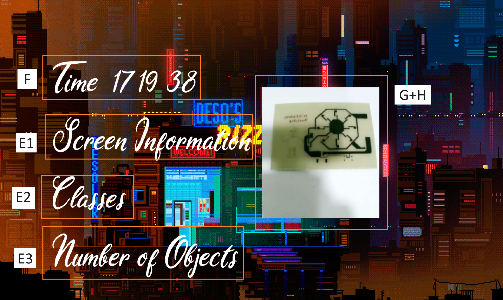

# Animated UI with Custom Font

This code creates an animated user interface (UI) using OpenCV. It displays a GIF animation and overlays text elements on top of it using a custom font. The UI also includes a static image that can be zoomed in and out. The code utilizes the PIL library to handle the custom font rendering.
1. Import all required libraries
    ```python
    import cv2
    import numpy as np
    import datetime
    import imageio
    import os
    from PIL import ImageFont, ImageDraw, Image
    ```
## Functions

### `add_text(image, text, position, font_size, color, font_path)`

Adds text to an image using a custom font.

#### Parameters

- `image`: NumPy array representing the image.
- `text`: The text to be added.
- `position`: Tuple representing the position of the text (x, y).
- `font_size`: The font size.
- `color`: The color of the text (BGR format).
- `font_path`: The path to the custom font file.

#### Returns

- `image`: NumPy array representing the image with the added text.

### `imageio.get_reader(gif_path)`

Loads the gif animation
- `gif_path`: Path to the GIF animation file.

### `cv2.namedWindow(window_name, cv2.WINDOW_NORMAL)`

Loads CV2 window
- `window_name`: Name of the UI window.

### `cv2.setWindowProperty(window_name, cv2.WND_PROP_FULLSCREEN, cv2.WINDOW_FULLSCREEN)`

sets up the cv2 window settings

### `cv2.imread('img_path')`
Loads an image

### `gif_reader.get_data(frame_index)`
get current frame index

### `cv2.cvtColor(gif_frame, cv2.COLOR_RGB2BGR)`
Convert from rgb to bgr

### `np.copy(gif_frame_bgr)`
Copies the frame into an array

Set up date and time and gets the live hour minute and second data

### `cv2.resize(display_image, None, fx=zoom_scale, fy=zoom_scale, interpolation=cv2.INTER_LINEAR)`
Resizes the target image using base settings can check datasheet for options

### `cv2.imshow(window_name, output_image)`
Displays the output image in the window created

## Main Execution

1. Prepare the add text function.
    ```python
    def add_text(image, text, position, font_size, color, font_path):
        font = ImageFont.truetype(font_path, font_size)
        image_pil = Image.fromarray(image)
        draw = ImageDraw.Draw(image_pil)
        draw.text(position, text, font=font, fill=color)
        image = np.array(image_pil)
        return image
    ```

1. Load the GIF animation and create the UI window.
    ```python
    gif_path = 'path/to/gif/file.gif' #Make sure to replace the path
    gif_reader = imageio.get_reader(gif_path)
    ```
2. Setup the window information.
    ```python
    # Set up the UI window
    window_name = 'Animated UI'
    cv2.namedWindow(window_name, cv2.WINDOW_NORMAL)
    cv2.setWindowProperty(window_name, cv2.WND_PROP_FULLSCREEN, cv2.WINDOW_FULLSCREEN)
    ```
3. Set up the initial values of the UI elements.
    ```python
    screen_info = 'Screen Information: ...'
    class_info = 'Classes: ...'
    num_objects = 'Number of Objects: ...'
    font_size = 150
    font_color = (255, 255, 255)  # White color in BGR format
    x = 10
    offset = 40
    font_path = 'custom_font.ttf'  # Replace 'custom_font.ttf' with your actual font file name
    font_path = os.path.join(os.getcwd(), font_path)
    frame_index = 0
    frame_count = len(gif_reader)
    animation_fps = 30
    animation_delay = int(1000 / animation_fps)
    ```
4. Enter an infinite loop for updating and displaying the UI.
    
    
    ```python
    while True:
        
        # a. Get the current GIF frame.
        frame = gif_reader.get_data(frame_index)

        # b. Convert the frame to BGR format.
        frame_bgr = cv2.cvtColor(frame, cv2.COLOR_RGB2BGR)

        # d. Display the object detection results.
        frame_with_results = frame_bgr.copy()
        # Replace with your own code to display the object detection results on the frame.
    
        # e. Add text to the output image using the custom font.
        frame_with_text = add_text(frame_with_results, screen_info, (x, offset), font_size, font_color, font_path)
        frame_with_text = add_text(frame_with_text, class_info, (x, offset * 2), font_size, font_color, font_path)
        frame_with_text = add_text(frame_with_text, num_objects, (x, offset * 3), font_size, font_color, font_path)
    
        # f. Add the current time to the output image.
        current_time = time.strftime('%H:%M:%S', time.gmtime())
        frame_with_time = add_text(frame_with_text, f'Time: {current_time}', (x, offset * 4), font_size, font_color, font_path)
    
        # g. Resize the image for zooming.
        zoom_factor = 2
        zoomed_frame = cv2.resize(frame_with_time, None, fx=zoom_factor, fy=zoom_factor)

        # h. Display the zoomed image on the output image.
        display_image[10:zoomed_frame.shape[0]+10, 10:zoomed_frame.shape[1]+10] = zoomed_frame

        # i. Display the output image in the UI window.
        cv2.imshow(window_name, display_image)

    
        # j. Update the frame index for the next frame.
        frame_index = (frame_index + 1) % frame_count

        # k. Wait for a key press and exit the loop if 'q' is pressed.
        if cv2.waitKey(animation_delay) & 0xFF == ord('q'):
            break
    ```

5. Clean up and close all windows.
    ```python
    cv2.destroyAllWindows()
    ```

**Note:**
- Replace `'custom_font.ttf'` with the actual file name of your own custom font file.
- Ensure that the custom font file is placed in the same directory as the Python script.