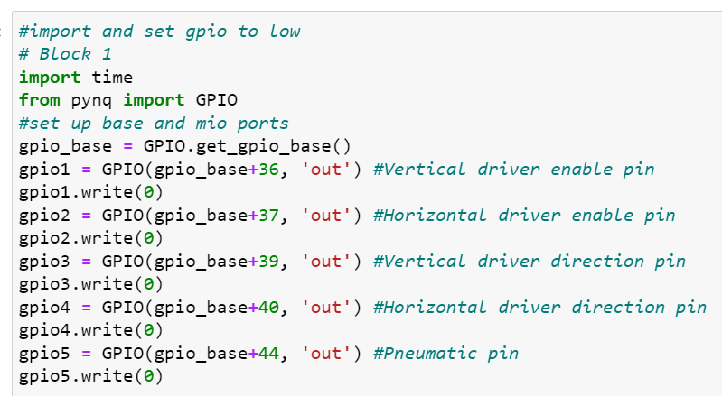
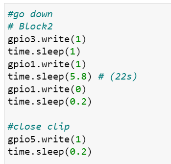
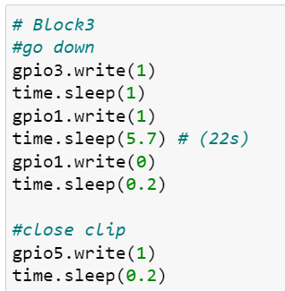

# PCB Etching Production Line User Manual

## For Mechanical part (Etching production line)
### Process/Operation:
1. **Don't connect the circulation pump and heating element**, unless there is enough etching liquid (or just water) in the etching tank.
2. Make sure **Big Red Button (E-Stop)** is pressed **DOWN**, before plugging in the power supply.
3. Connect USB-A plug to PC.
4. Enter **192.168.3.1** in browser URL bar, to access the notebook.
5. Login credentials: "xilinx" & "xilinx".
6. Navigate to "RUN_ETCHER_WITH_THIS" > "ETCHING_CONTROL.ipynb".
7. Run **Block 1** of the Jupyter notebook, for setting ALL GPIO to low.

8. Then release the Big Red Button (E-Stop).
9. Run **Block 2**, to grab and transport PCB for etching, then clamp moving up and go into standby.

10. Wait til etching process finishes.
11. After etching is done, run **Block 3** to grab etched PCB from tank and go to rinse, then go back to starting point, then back to original position for standby.

12. It is a good idea to leave the Big Red Button (E-Stop) down after use and unplugged, just in case.
13. You can use the "Run All" command to sequentially run through all code blocks, demonstrating a full production cycle.

### Debugging:
1. Need to move motor somewhere?
    1. Create a new block at the end of code.
    2. Copy code (Forward, Backward, Up, Down) from the code blocks.
    3. **time.sleep(x)**, change x to 1, for small steps, run multiple times until it bumps against the linear rail end and skips steps (but don’t worry it’s fine, for a limited amount of time)

## For AI recognition part (AI QC)
1. Plug in USB power for LCD screen, it should turn on blue or camera feed.
2. If signal acting up, unplug the **Mini-DP plug** and re-plug it.
3. Click the run all button located next to the restart button on the top

## For Pneumatic pump Operation:
1. Connect the pipes.
2. Plug in the power for compressor.
3. Press the **ON button** to let compressor do its work, until target pressure is met.
4. For the pressure regulator-thing, pull out **the middle plastic cap** and **turn towards “+” sign** direction, the number on gauge should climb up, **set it to 0.2MPa**, press the plastic cap back in to **lock position**.
5. After use, pull plastic cap and **turn it towards “-”**, till it **drops to 0, lock cap**.