# Overlay Guide

## **Step 1**

1. Open Vivado.
2. Select "New Project" and click "Next" until you reach the board selection.

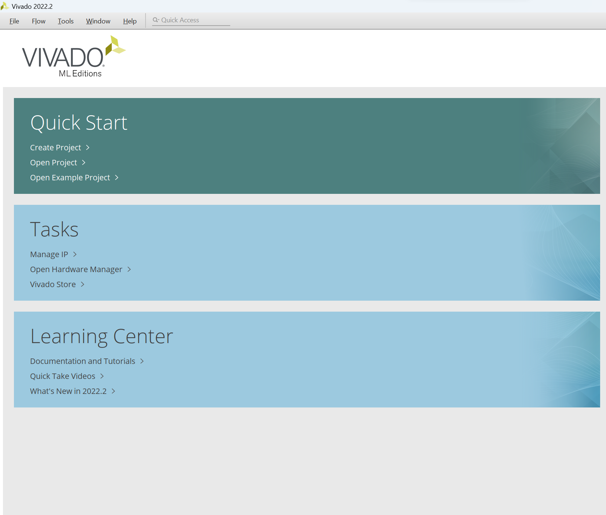

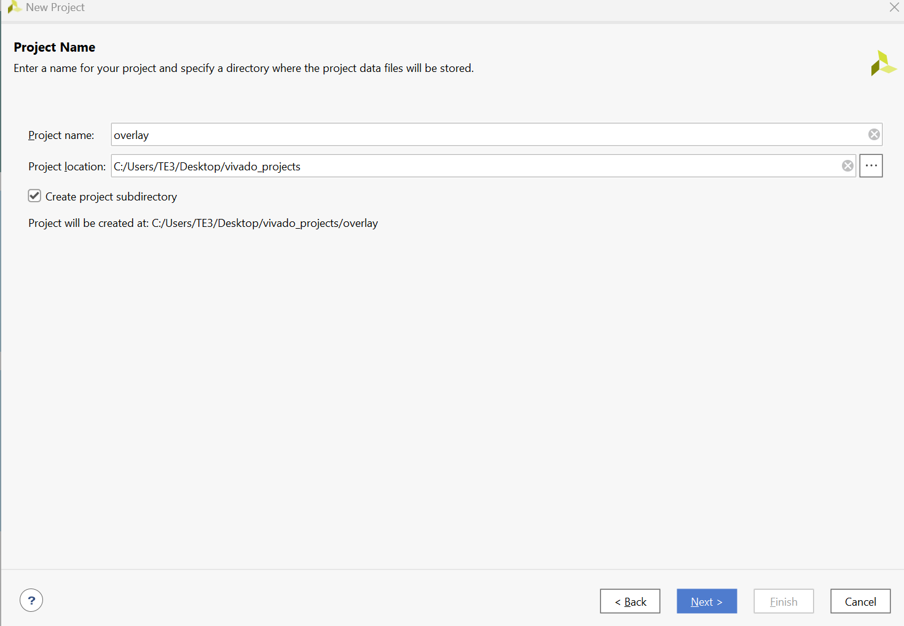

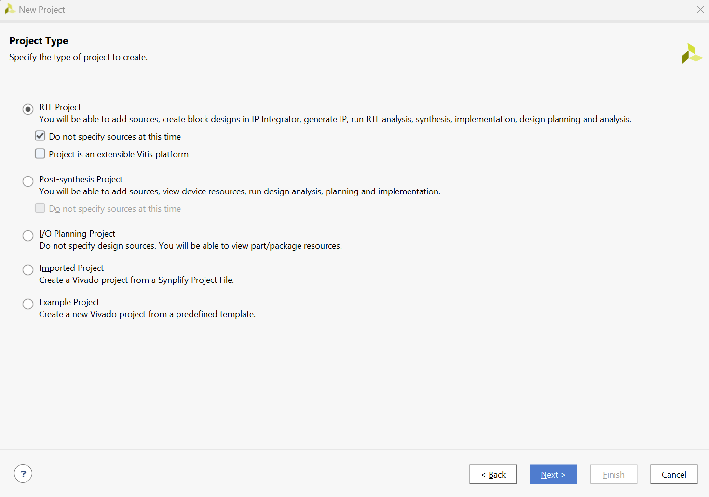

3. Click "Refresh" and download "ultra96v2". Select it, then click "Finish".

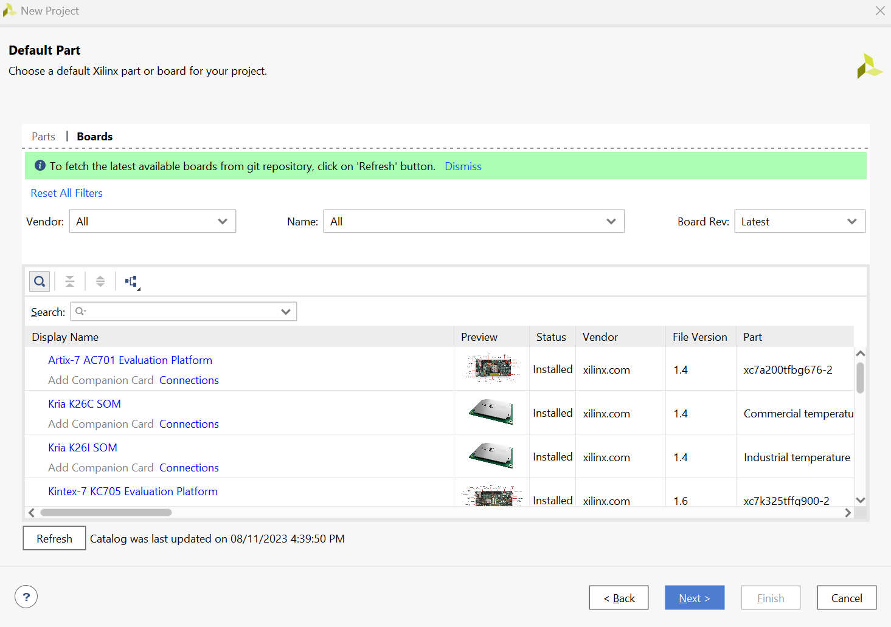

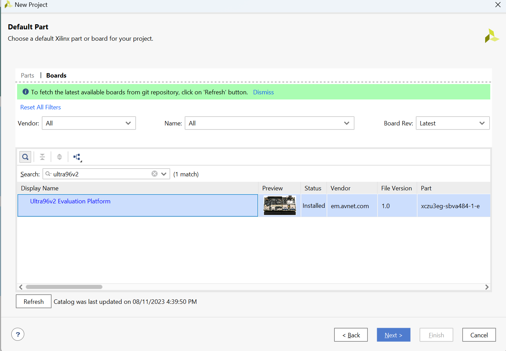

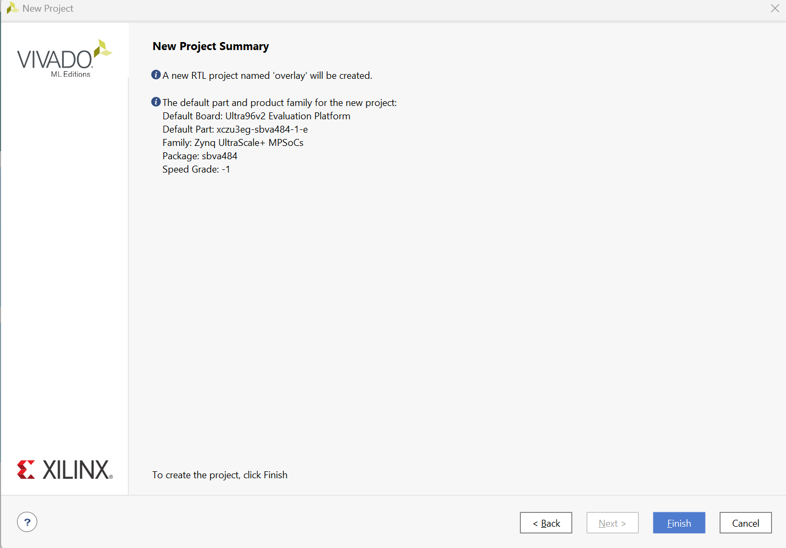

## **Step 2**

1. On the left, create a new IP block design and give it a name, e.g., "overlay".

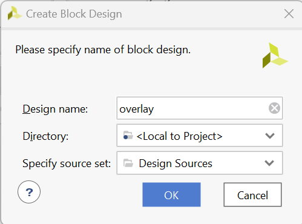

2. Inside the block design, on the right, click the "+" sign and add the Zynq MPSoC block. Click "Finish".

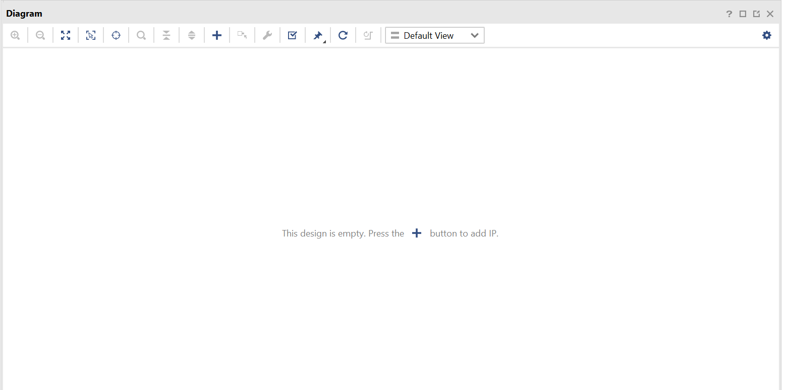

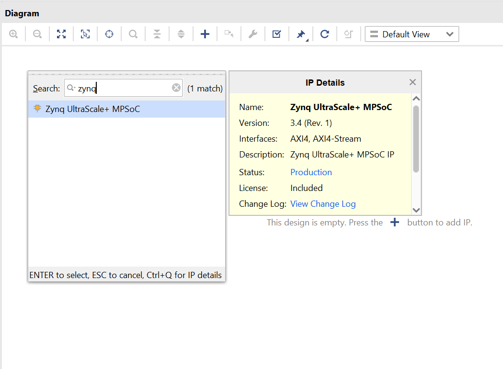

3. Once it loads, double-click the Zynq MPSoC block to customize its IP settings.

4. Go to GPIO as seen in the photo and change "EMIO" to "16". This allows 16 GPIOs to be mapped using PL (Programmable Logic).

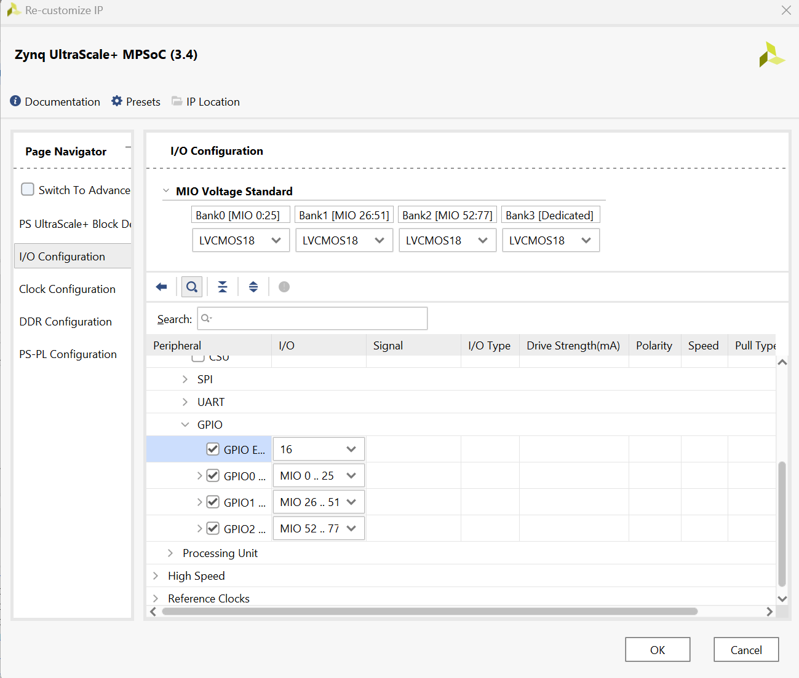

5. Right-click the Zynq MPSoC block on the block design and select "Make External". Make sure to give it the name "GPIO" by selecting it 
first. On the left, a box should appear showing its name.

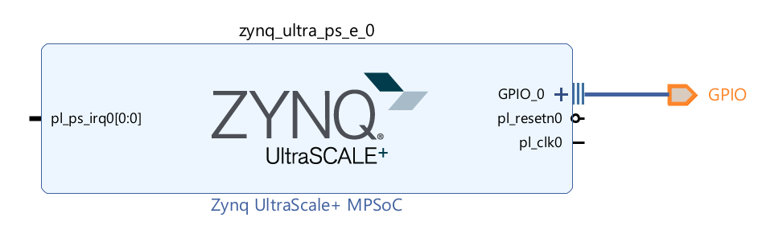

6. Once done, on the left side of the design, you should see the file. Right-click it and select the "HDL Wrapper" option.

##  **Now, let's map the GPIO to their pins:**

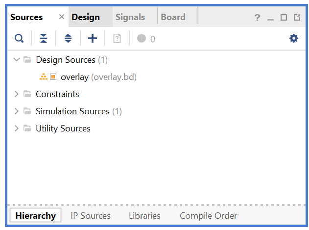

1. To do so, right-click the constraint source and select "Add a New Source". Choose "Constraints".

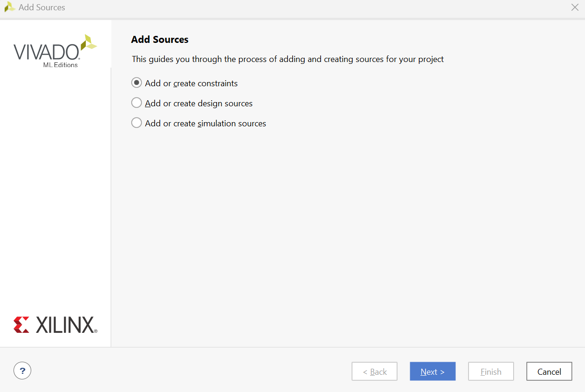

2. Open the file by double-clicking it. Or create a new file and copy the below code into it

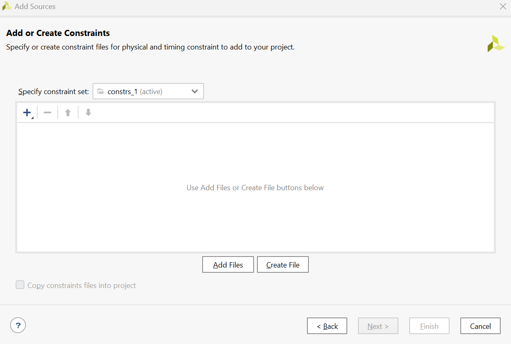

3. Add the following code:

```vhdl
set_property PACKAGE_PIN D7 [get_ports {GPIO_tri_io[0]}]
set_property PACKAGE_PIN F8 [get_ports {GPIO_tri_io[1]}]    
set_property PACKAGE_PIN F7 [get_ports {GPIO_tri_io[2]}]
set_property PACKAGE_PIN G7 [get_ports {GPIO_tri_io[3]}]
set_property PACKAGE_PIN F6 [get_ports {GPIO_tri_io[4]}]
set_property PACKAGE_PIN G5 [get_ports {GPIO_tri_io[5]}]
set_property PACKAGE_PIN A6 [get_ports {GPIO_tri_io[6]}]
set_property PACKAGE_PIN A7 [get_ports {GPIO_tri_io[7]}]             
set_property PACKAGE_PIN G6 [get_ports {GPIO_tri_io[8]}]             
set_property PACKAGE_PIN E6 [get_ports {GPIO_tri_io[9]}]             
set_property PACKAGE_PIN E5 [get_ports {GPIO_tri_io[10]}]           
set_property PACKAGE_PIN D6 [get_ports {GPIO_tri_io[11]}]           
set_property PACKAGE_PIN D5 [get_ports {GPIO_tri_io[12]}]            
set_property PACKAGE_PIN C7 [get_ports {GPIO_tri_io[13]}]
set_property PACKAGE_PIN B6 [get_ports {GPIO_tri_io[14]}]
set_property PACKAGE_PIN C5 [get_ports {GPIO_tri_io[15]}]

set_property IOSTANDARD LVCMOS18 [get_ports GPIO_tri_io*]
```

Make sure to save the file and that the name matches the name you set on the GPIO pin.

Once done make sure to create the hdl wrapper by right clicking the design source file and selecting "Create HDL Wrapper"

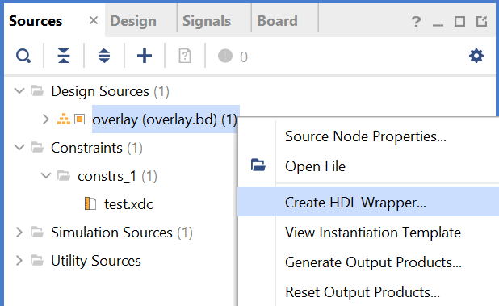

## Save the file. Then, click "Generate Bitstream" on the left.

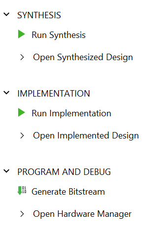

If everything is correct, it should generate the bitstream.

## Once that's done, go to your project directory and remove the .tcl, .hwh, and .bit files. They should have a similar name to your project

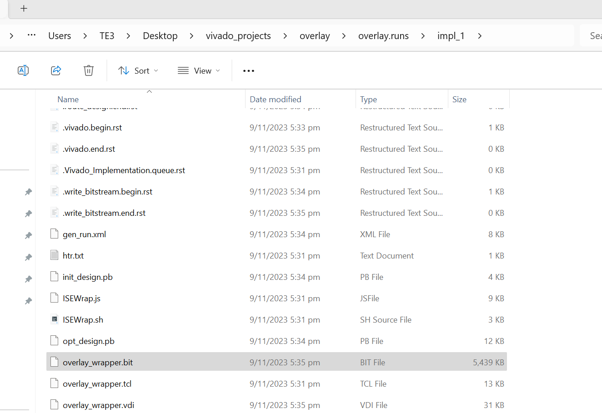

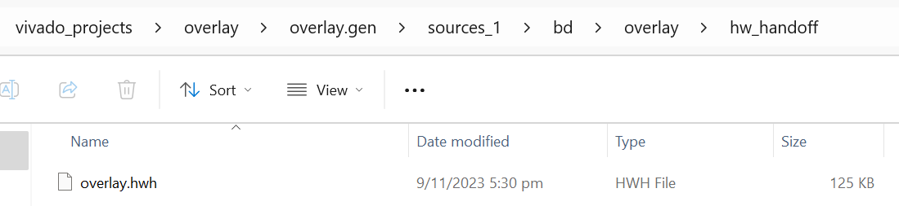

Rename them such that they have the same name

## Part 2 Using Axi

Make sure to set up the axi on zynq by activating it on the PS-PL interface 

Search Axi block from the ip library and add the axi interconnect block

Choose the block you want from uart i2c PWM etc and add it to the block design

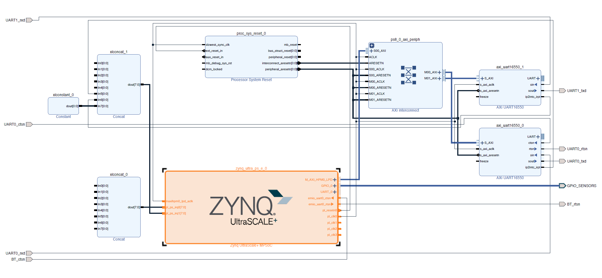

Make sure to connect it to a Axi interconnect block as well as a processor system reset

Then map the pins externally and set the LVCMOS to 1.8V

```vhdl
set_property IOSTANDARD LVCMOS18 [get_ports UART*]
set_property IOSTANDARD LVCMOS18 [get_ports GPIO_SENSORS_tri_io*]
#set_property IOSTANDARD LVCMOS18 [get_ports loopback_out*]

#HD_GPIO_2 on FPGA / Connector pin 7 / UART0_rxd
set_property PACKAGE_PIN F7 [get_ports UART0_rxd]
#HD_GPIO_1 on FPGA / Connector pin 5 / UART0_txd
set_property PACKAGE_PIN F8 [get_ports UART0_txd]
#HD_GPIO_3 on FPGA / Connector pin 9 / UART0_rts
set_property PACKAGE_PIN G7 [get_ports UART0_rtsn]
#HD_GPIO_0 on FPGA / Connector pin 3 / UART0_cts
set_property PACKAGE_PIN D7 [get_ports UART0_ctsn]

#HD_GPIO_5 on FPGA / Connector pin 13 / UART1_rxd
set_property PACKAGE_PIN G5 [get_ports UART1_rxd]
#HD_GPIO_4 on FPGA / Connector pin 11 / UART1_txd
set_property PACKAGE_PIN F6 [get_ports UART1_txd]   


#HD_GPIO_6 on FPGA / Connector pin 29 / GPIO-G on 96Boards 
set_property PACKAGE_PIN A6 [get_ports {GPIO_SENSORS_tri_io[0]}] 
#HD_GPIO_13 on FPGA/ Connector pin 30 / GPIO-H on 96Boards                                                             
set_property PACKAGE_PIN C7 [get_ports {GPIO_SENSORS_tri_io[1]}] 
#HD_GPIO_7 on FPGA / Connector pin 31 / GPIO-I on 96Boards
set_property PACKAGE_PIN A7 [get_ports {GPIO_SENSORS_tri_io[2]}]
#HD_GPIO_14 on FPGA/ Connector pin 32 / GPIO-J on 96Boards 
set_property PACKAGE_PIN B6 [get_ports {GPIO_SENSORS_tri_io[3]}]
#HD_GPIO_8 on FPGA / Connector pin 33 / GPIO-K on 96Boards 
set_property PACKAGE_PIN G6 [get_ports {GPIO_SENSORS_tri_io[4]}] 
#HD_GPIO_15 on FPGA/ Connector pin 34 / GPIO-L on 96Boards                                                             
set_property PACKAGE_PIN C5 [get_ports {GPIO_SENSORS_tri_io[5]}] 


set_property IOSTANDARD LVCMOS18 [get_ports BT*]

#BT_HCI_RTS on FPGA /  emio_uart0_ctsn connect to 
set_property PACKAGE_PIN B7 [get_ports BT_ctsn]
#BT_HCI_CTS on FPGA / emio_uart0_rtsn
set_property PACKAGE_PIN B5 [get_ports BT_rtsn]
```

Done

