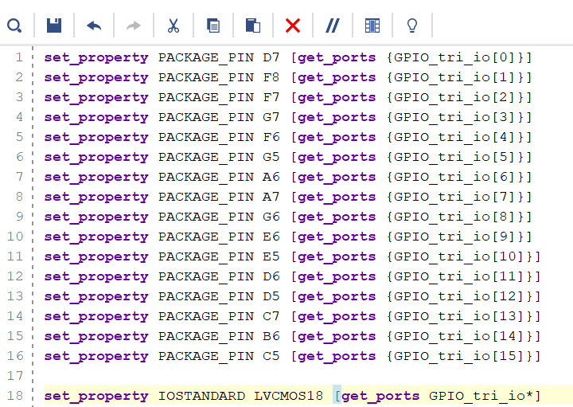
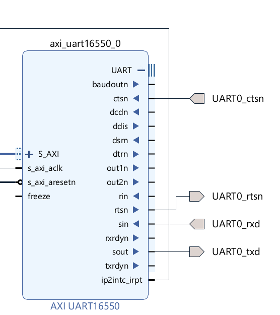

# Overlay Guide

## **Step 1**

1. Open Vivado.
2. Select "New Project" and click "Next" until you reach the board selection.


3. Click "Refresh" and download "ultra96v2". Select it, then click "Finish".


## **Step 2**

1. On the left, create a new IP block design and give it a name, e.g., "overlay".


2. Inside the block design, on the right, click the "+" sign and add the Zynq MPSoC block. Click "Finish".


3. Once it loads, double-click the Zynq MPSoC block to customize its IP settings.


4. Go to GPIO as seen in the photo and change "EMIO" to "16". This allows 16 GPIOs to be mapped using PL (Programmable Logic).


5. Disable Axi master interface by going to the PS-PL Configuration, PS-PL interface, Master Interface and uncheck the AXI HPM0 LPD.


6. Right-click the GPIO on the ZYNQ block design and select "Make External". Make sure to give it the name "GPIO" by selecting it 
first. On the left, a box should appear showing its name.


6. Once done, on the left side of the design, you should see the file. Right-click it and select the "HDL Wrapper" option. Incase you change anything make sure to redo this step otherwise you will get an error in later stages.


##  **Now, let's map the GPIO to their pins:**

1. To do so, right-click the constraint source and select "Add a New Source". Choose "Constraints".


2. Open the file by double-clicking it. Or create a new file and copy the below code into it


3. Add the following code:



```vhdl
set_property PACKAGE_PIN D7 [get_ports {GPIO_tri_io[0]}]
set_property PACKAGE_PIN F8 [get_ports {GPIO_tri_io[1]}]    
set_property PACKAGE_PIN F7 [get_ports {GPIO_tri_io[2]}]
set_property PACKAGE_PIN G7 [get_ports {GPIO_tri_io[3]}]
set_property PACKAGE_PIN F6 [get_ports {GPIO_tri_io[4]}]
set_property PACKAGE_PIN G5 [get_ports {GPIO_tri_io[5]}]
set_property PACKAGE_PIN A6 [get_ports {GPIO_tri_io[6]}]
set_property PACKAGE_PIN A7 [get_ports {GPIO_tri_io[7]}]             
set_property PACKAGE_PIN G6 [get_ports {GPIO_tri_io[8]}]             
set_property PACKAGE_PIN E6 [get_ports {GPIO_tri_io[9]}]             
set_property PACKAGE_PIN E5 [get_ports {GPIO_tri_io[10]}]           
set_property PACKAGE_PIN D6 [get_ports {GPIO_tri_io[11]}]           
set_property PACKAGE_PIN D5 [get_ports {GPIO_tri_io[12]}]            
set_property PACKAGE_PIN C7 [get_ports {GPIO_tri_io[13]}]
set_property PACKAGE_PIN B6 [get_ports {GPIO_tri_io[14]}]
set_property PACKAGE_PIN C5 [get_ports {GPIO_tri_io[15]}]

set_property IOSTANDARD LVCMOS18 [get_ports GPIO_tri_io*]
```

Make sure to save the file and that the name matches the name you set on the GPIO pin.

Once done make sure to create the hdl wrapper by right clicking the design source file and selecting "Create HDL Wrapper"


4. Save the file. Then, click "Generate Bitstream" on the left.


If everything is correct, it should generate the bitstream.

## Once that's done, go to your project directory and remove the .tcl, .hwh, and .bit files. They should have a similar name to your project


Rename them such that they have the same name

## Part 2 Using Axi

Similar to the first section create a new porject and choose Ultra96v2. Create a new block design and search for the following components. 

Axi Interconnect, Processor System Reset, UART 16550, concat, ZYNQ UltraScale+ MPSOC. Add them to the block design.

Make sure to add 2 UART blocks to the design.


Now the first thing we will do is run the block automation.


This will help speed up the block design process and require us to change less things required.

Once that is done double click on the ZYNQ block, and go to the GPIO page like in the previous example and change emio to 5 as some of the pins will be used for uart.


Once this is done if you look above on the same page, you will find uart0 please activate MODEM.


Now that we have the two we also have to deactive one of the master axi ports. To do so, go to the PS-PL interface section like shown in the gpio example in part 1.

Uncheck AXI HPM1 FPD or AXI HPM0 LPD or both based on your system. Only AXI HPM0 FPD is required.


Now save the changes and check whether the UART and GPIO show up on the ZYNQ block design.

Now lets map the GPIO and UART externally such that it is connected to external pins.

To do so, right click on the GPIO and click make external. Then rename the gpio flag to GPIO_SENSORS.

For UART first open up the UART by clicking on the UART icon on the ZYNQ. Then right click on emio_uart0_ctsn and click make external. Rename the flag to BT_ctsn.

Repeat this for emio_uart_rtsn but rename that flag to BT_rtsn. Double check the figure below to see if you have everything done correctly.


That is one way to map the uart. Another method would be to use the AXI Interconnect block, UART 16550 and Processor System Reset.

To do that, first connect the M_AXI_HPMI_FPD to the slave port of the AXI Interconnect S00 AXI. Then connect the master ports of the Axi Connect to the slave ports of each UART 16550 blocks.


After this, connect the interconnect_aresetn from the Processor System Reset to AResetN on the Axi Interconnect.


Finally select the Run Connection Automation on the top.


Select ALL and click OK


The wires should automatically route for you leaving the UART pin mapping left and the interupt left.

To Map the UART pins, first expand the UART icon on the UART 16550 block like you did on the ZYNQ block.

Then make external the following pins.



ctsn should have the name UART0
_ctsn

rtsn should have the name UART0_rtsn

sin should have the name UART0_rxd

sout should have the name UART0_txd

Repeat this process for UART1 16550 block.


sin should have the name UART1_rxd

sout should have the name UART1_txd

Finally the last step would be to connect the ip2intc_irpt from both the UART 16550 to the concat blocks like the following.


The dout should be connected to pl_ps_irq0


Finally, create a new constraint file as shown previously and adding the following constraints.


```vhdl
set_property IOSTANDARD LVCMOS18 [get_ports UART*]
set_property IOSTANDARD LVCMOS18 [get_ports GPIO_SENSORS_tri_io*]
#set_property IOSTANDARD LVCMOS18 [get_ports loopback_out*]

#HD_GPIO_2 on FPGA / Connector pin 7 / UART0_rxd
set_property PACKAGE_PIN F7 [get_ports UART0_rxd]
#HD_GPIO_1 on FPGA / Connector pin 5 / UART0_txd
set_property PACKAGE_PIN F8 [get_ports UART0_txd]
#HD_GPIO_3 on FPGA / Connector pin 9 / UART0_rts
set_property PACKAGE_PIN G7 [get_ports UART0_rtsn]
#HD_GPIO_0 on FPGA / Connector pin 3 / UART0_cts
set_property PACKAGE_PIN D7 [get_ports UART0_ctsn]

#HD_GPIO_5 on FPGA / Connector pin 13 / UART1_rxd
set_property PACKAGE_PIN G5 [get_ports UART1_rxd]
#HD_GPIO_4 on FPGA / Connector pin 11 / UART1_txd
set_property PACKAGE_PIN F6 [get_ports UART1_txd]   


#HD_GPIO_6 on FPGA / Connector pin 29 / GPIO-G on 96Boards 
set_property PACKAGE_PIN A6 [get_ports {GPIO_SENSORS_tri_io[0]}] 
#HD_GPIO_13 on FPGA/ Connector pin 30 / GPIO-H on 96Boards                                                             
set_property PACKAGE_PIN C7 [get_ports {GPIO_SENSORS_tri_io[1]}] 
#HD_GPIO_7 on FPGA / Connector pin 31 / GPIO-I on 96Boards
set_property PACKAGE_PIN A7 [get_ports {GPIO_SENSORS_tri_io[2]}]
#HD_GPIO_14 on FPGA/ Connector pin 32 / GPIO-J on 96Boards 
set_property PACKAGE_PIN B6 [get_ports {GPIO_SENSORS_tri_io[3]}]
#HD_GPIO_8 on FPGA / Connector pin 33 / GPIO-K on 96Boards 
set_property PACKAGE_PIN G6 [get_ports {GPIO_SENSORS_tri_io[4]}] 
#HD_GPIO_15 on FPGA/ Connector pin 34 / GPIO-L on 96Boards                                                             
set_property PACKAGE_PIN C5 [get_ports {GPIO_SENSORS_tri_io[5]}] 


set_property IOSTANDARD LVCMOS18 [get_ports BT*]

#BT_HCI_RTS on FPGA /  emio_uart0_ctsn connect to 
set_property PACKAGE_PIN B7 [get_ports BT_ctsn]
#BT_HCI_CTS on FPGA / emio_uart0_rtsn
set_property PACKAGE_PIN B5 [get_ports BT_rtsn]
```
Then click generate bitstream like shown previously to generate the overlay.

Done

